# Linux

## 一、Linux 入门

### 1、简介

- 一种开源的、免费的操作系统，安装在计算机硬件上、用来管理计算机的硬件和软件资源的系统软件

- 优缺点：
  - 优点：
    - Linux 注重**安全性、稳定性、高并发**处理能力
    - Linux 主要用于企业服务器，Windows 用于个人计算机上
  - 缺点：
    - **Linux没有优越的可视化界面**
- Linux 的主要发行版本：
  - Ubuntu(乌班图)、RedHat(红帽)、**CentOS**、Debain(蝶变)、Fedora、SuSE、OpenSUSE、红旗Linux(国产)

### 2、安装Linux操作系统

- 虚拟机：可以**用软件模拟出一套具有完整硬件系统功能的、运行在一个完全隔离环境中的完整计算机系统**
- 安装 Linux：Linux 的镜像

### 3、Linux的目录结构

- Linux只有一个根目录：**/**

- 层级式的目录结构：

  | 目录结构       | 功能与作用                                                   |
  | -------------- | ------------------------------------------------------------ |
  | bin -> usr/bin | 系统的可执行文件，可以在任何目录下执行                       |
  | usr/local/bin  | 用户自己的可执行文件，可以在任何目录下执行                   |
  | etc            | 存放配置文件，配置环境变量（ /etc/profile ）                 |
  | home           | 每一个用户的根目录，用来保存用户的数据，默认情况下，目录名和自己的用户名一致 |
  | opt            | 存放用户额外安装的软件                                       |

- 图示：

  

### 4、Linux的远程操作软件

- [Xshell](https://www.netsarang.com)：Linux 的终端模拟软件
- [Xftp](https://www.netsarang.com)：文件传输协议

> 查看 Linux 系统的 ip 地址：==ifconfig	或	ip a==

---

## 二、vi 和 vim 编辑器

### 1、简介

- vi/vim是 Linux 中的文本编辑器，用来在 Linux 中创建、查看或者编辑文本文件

### 2、基本使用

- 一般模式：

  > 用 vi 或者 vim 命令打开文件（==vim test.txt==），进入了一般模式，**可以查看文件的内容，并且可以通过上下左右键移动光标，查看文件某一个部分，但是不能编辑文件内容**

  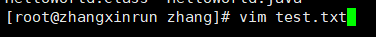

- 编辑模式：

  > 在一般模式下，按 ==i== 键或者 ==a== 键，进入编辑模式，可以编辑文件内容，但是不能保存编辑的内容

  - ==i/a==：插入

  

  

- 命令模式：

  > 在一般模式下，按 ==shift + :==，进入命令模式

  - ==q!==：不保存，强制退出编辑器
  - ==wq==：保存并退出编辑器
  - ==q==：只退出编辑器
  
- 图示：

  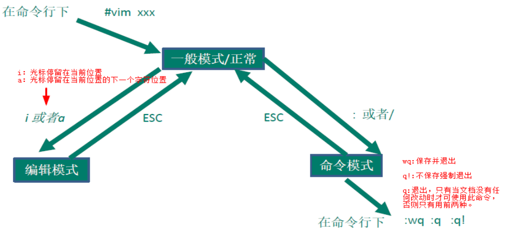

### 3、快捷键

- 复制/粘贴单行（一般模式下）：
  - ==yy==：把光标所在行复制到剪切板
  - ==p==：把剪切板中的内容粘贴到光标所在的下一行
- 复制/粘贴多行（一般模式下）：
  - ==5yy==：把光标所在行往下5行复制到剪切板
  - ==p==：把剪切板中的内容粘贴到光标所在的下一行
- 在文本文件中查找关键字（命令行模式下）：
  - ==/关键字  +  回车==
  - ==n==：表示光标查找下一个关键字
- 删除单行（一般模式下）：
  - ==dd==：删除光标所在的当前行
- 删除多行（一般模式下）：
  - ==5dd==：删除光标所在行往下5行
- 撤销上次编辑的内容（一般模式下）：==u==
- 显示行号（命令模式下）：==set nu  +  回车==
- 取消显示行号（命令模式下）：==set nonu  +  回车==

---
## 三、用户管理

### 1、介绍

- 任何使用 Linux 系统资源的用户，必须使用一个合法的账号和密码，账号和密码一般都是向系统管理员申请
- root 是 Linux 系统安装时默认创建的系统管理员账号，由 root 用户创建普通账号	

### 2、添加用户

- ==useradd  [选项]  用户名==

#### 底层原理

- **useradd lisi**
  - **创建一个用户 lisi**
  - **在 /home 目录下创建用户的根目录，目录名默认和用户名相同**
  - **在 Linux 中任何一个用户都至少属于一个组，新建用户时如果不指定组，则会新建一个组，组名跟用户名相同，并且把该用户添加到该组中**
- ==useradd -d  路径  用户名==：创建用户的同时，指定用户的根目录

### 3、给用户设置密码

- ==passwd  用户名==：密码需要满足一定的复杂度

### 4、删除用户

- ==userdel  [选项]  用户名==
- ==userdel -r 用户名==：删除用户的同时级联删除它的主目录

### 5、查看用户信息

- ==id  用户名==

### 6、切换用户

- ==su  用户名==
  - **从权限高的用户切换到权限低的用户，不需要密码验证**
  - **从权限低的用户切换到权限高的用户，必须要密码验证**

---

## 四、组管理

### 1、介绍

- Linux 中的组相当于角色的概念，可以对有共性的用户进行统一的管理
- **每一个用户至少属于一个组，不能独立于组存在，也可以属于多个组**
- 在 Linux 中**任何一个用户都至少属于一个组，新建用户时如果不指定组，则会新建一个组，组名跟用户名相同，并且把该用户添加到该组中**

### 2、添加组

- ==groupadd  组名==

### 3、删除组

- ==groupdel  组名==

### 4、把用户添加到组中

- ==gpasswd -a   用户名  组名==

### 5、把用户从组中移除
- ==gpasswd -d  用户名  组名==

### 6、创建用户时，指定所属的组（主组）

- ==useradd -g  组名  用户名==

---

## 五、系统操作命令

### 1、关机

- ==shutdown now==：立刻关机
- ==shutdown -h 时间==：定时关机
- ==shutdown -r now==：立即重启

### 2、重启

- ==reboot==：立即重启
- ==sync==：同步数据库

---

## 六、帮助命令

### 1、查看 Linux 系统手册上的帮助信息

- ==man  命令名称==：分屏显示、按回车翻一行、按空格翻一页、按 q 键退出查看

  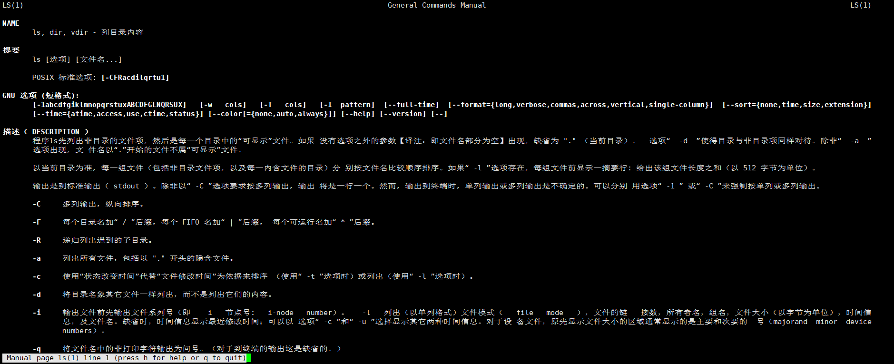

- ==help  命令名称==：用来查看命名的内置帮助信息

  - 例如：**help**

    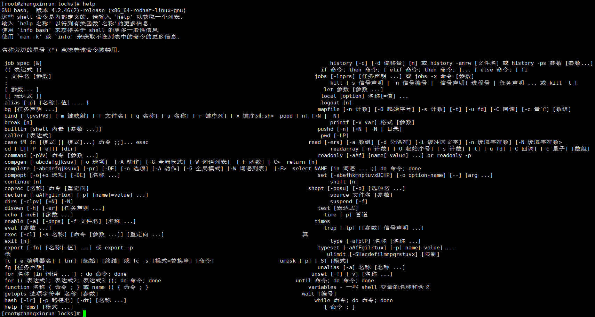

---

## 七、文件的目录操作命令

### 1、查看当前所在的目录
- ==pwd==

  

### 2、查看指定目录下的所有的子目录或者文件列表

- ==ls [选项] [指定目录]==
  
  - ==ls==：查看当前目录下的所有的子目录和文件列表
  
    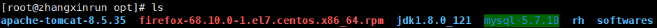
  
  - ==ls -l  [目录名]==：以列表的形式显示
  
    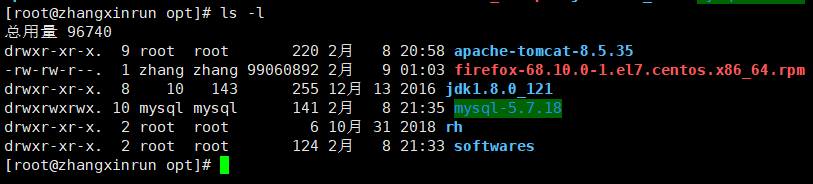
  
  - ==ls -a  [目录名]==：显示指定目录下的所有子目录和文件（包括虚拟的目录）
  
    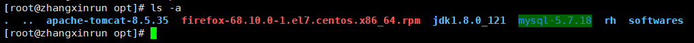
  
  - ==ls -al  [目录名]==：以列表的形式显示指定目录下所有的子目录和文件（包括虚拟的目录）
  
    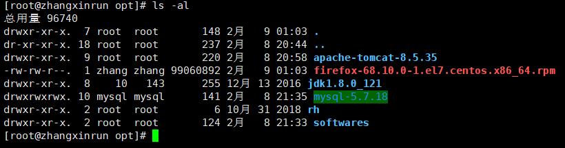

### 3、切换目录

- ==cd  目录名==
  - 绝对目录：以盘符开始的目录叫做绝对目录
    - ==~==：当前用户的根目录
  - 相对目录：以目录名开始的目录叫相对目录
    - ==.==：当前目录
    - ==..==：当前目录的上一级目录

### 4、创建目录

- ==mkdir  [选项]  目录名==
- ==mkdir  -p  目录路径==：一次创建多级目录

### 5、删除一个空文件

- ==rmdir  目录名==

### 6、创建一个或多个空文件

- ==touch  文件名列表==（文件名之间用空格隔开）

### 7、复制文件/目录

- ==cp [选项] source(源文件/目录) dest(目标文件/目录)==
- ==cp -r source(源文件/目录) dest(目标文件/目录)==：递归复制目录

### 8、删除文件/目录

- ==rm [选项] 文件名/目录名==
- ==rm -f 文件名==：强制删除文件
- ==rm -r 目录名==：提示递归删除目录
- ==rm -rf 文件或目录==：无提示直接强制递归删除

### 9、移动目录或者文件（文件重命名/剪切）

- ==mv  source(源)  dest(目标)==：如果目标中已经存在该文件或者目录，则会提示是否覆盖

### 10、查看文件内容

- ==cat 文件名==：文件内容一次性显示出来
- ==cat -n 文件名==：查看的时候显示行号
- ==cat 文件1 > 文件2==：复制文件内容

### 11、分页查看文件的内容

- ==more 文件名==：一次性加载文件所有内容到内存，分页显示
- ==less 文件名==：分页加载所有文件内容到内存，分页显示

> **按回车翻一行、按空格翻一页、按 q 退出查看**

### 12、查看文件的头几行

- ==head [选项] 文件名==
- ==head -n 查看的行数 文件名==

### 13、查看文件的后几行

- ==tail [选项] 文件名==
- ==tail -n 查看的行数 文件名==

### 14、输出系统变量或常量的值到命令行终端

- ==echo  内容==
  - 例如：
    - echo $JAVA_HOME
    - echo $PATH

### 15、把前一个查看命令（cat、more、less、head、tail）的结果输出到指定文件中

- ==查看命令（cat、more、less、head、tail...） >  文件名==
  - 如果输出文件不存在，则新建一个文件
  - 如果目标文件已存在，则把文件以前的内容覆盖

### 16、把前一个查看命令的结果追加输出到指定的文件中

- ==查看命令 >> 命令名==
  - 如果输出文件不存在，则新建一个文件
  - 如果目标文件已存在，则把文件以前的内容覆盖

---

## 八、日期和时间的操作命令

- 查看或设置系统的日期或者时间：
  - ==date==：查看系统当前的完整的日期和时间
  
    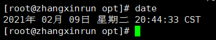
  
  - ==date +%Y==：系统当前的年份
  
    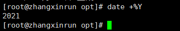
  
  - ==date +%m==：系统当前的月份
  
    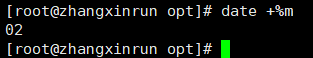
  
  - ==date +%d==：系统当前的日期
  
    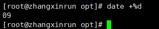
  
  - 按照 yyyy-MM-dd HH:mm:ss 的格式显示：==date '+%Y-%m-%d %H:%M:%S'==
  
    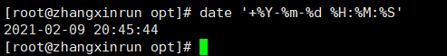
  
  - 设置当前的系统时间：==date -s '2020-10-20 10:20:30'==
  
    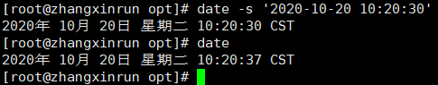
- 查看系统日历：
  - ==cal==：查看当前月份到的日历
  
    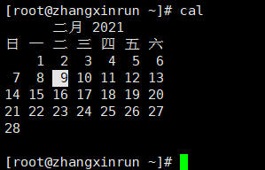
  
  - ==cal  年份==：查看指定年份的日历
  
    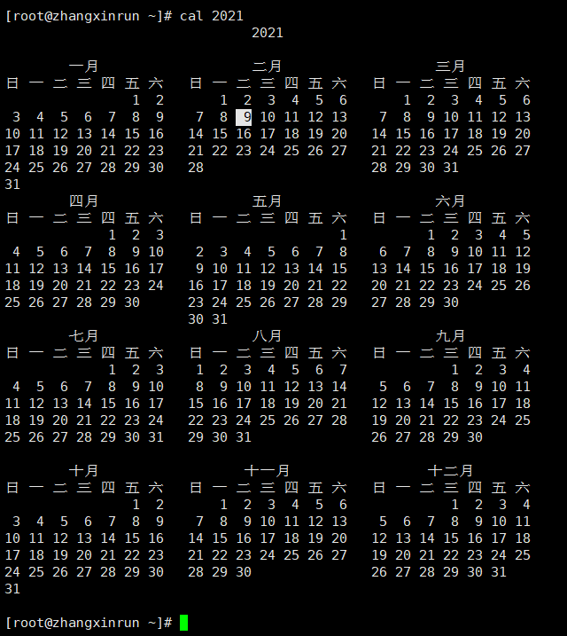

---

## 九、搜索文件或目录的命令

### 1、从当前目录下搜索文件或目录

- ==find  [搜索范围] [搜索标准]  关键字==
  - -name：默认按名称搜索（默认）
  - -size：按文件大小搜索
  - -user：按文件所有者搜索
- ==find  *.txt==：搜索当前目录下所有以 .txt结尾的文件
- ==find /etc *.txt==：搜索 /etc 目录下所有以 .txt 结尾的文件
- ==find /etc -size -5k==：搜索 /etc 目录下所有小于 5kb 的文件

### 2、在目录树中搜索文件或目录（根据名称搜索，效率高）

- ==locate  关键字==：目录树中查找文件或目录
- ==updatedb==：手动更新数据库

### 3、搜索过滤命令，在前一个搜索命令的结果中进行按名称进一步过滤

- ==搜索命令  |grep  [选项] 过滤条件==
- ==查看命令  |grep  [选项] 过滤条件==

---

## 十、压缩和解压缩的指令

### 1、压缩或解压单个文件：

- ==gzip  文件名==：压缩单个文件，生成一个 .gz 的压缩包，并且会把原来的文件删除

- ==gunzip 文件名==：解压 .gz 压缩包，并会把原来的 .gz 压缩包删除

### 2、压缩（打包）或者解压多个文件或目录

- ==zip  目标压缩包名称（通常使用 .zip 压缩包）  文件或者目录列表==
- ==unzip  压缩包名（.zip）-d  解压目录==：将指定的 .zip 压缩包解压到当前目录（或指定目录）
- ==tar  [选项]  目标压缩包名（xxx.tar.gz）文件或目录列表==
  - 例子：**tar  -zcvf  xxx.tar.gz  文件或者目录列表**
- ==tar  [选项]  压缩包名（xxx.tar.gz） -C 解压目录名==
  - tar  -zxvh  xxx.tar.gz  -C  解压目录名

---

## 十一、文件与组

> 在 Linux 中，每一个文件或者目录也必须属于一个组，而且只能属于一个组

### 1、在文件或者目录来看，Linux 系统中所有的用户分为三类

- 所有者：默认情况下，文件或者目录的所有者都是创建者，可以修改
- 同组用户：跟文件或者目录属于同一个组的用户
- 其他组用户：既不是文件或者目录的所有者，也不是同组用户

### 2、查看文件的所有者和所在的组

- ==ls -l==：等同于==ll==

  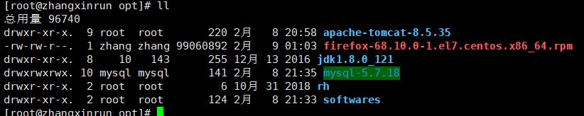

### 3、修改文件或者目录的所有者

- 基本语法：
  - ==chown  新的所有者  文件/目录名==
  - ==chown  [选项]  新的所有者：新的组  文件/目录名==
  - ==chown  -R  新的所有者：新的组  文件名==
    - 作用：递归修改目录的所有者和所在的组

### 4、修改文件或者目录的所在组

- ==chgrp  [选项]  新的组  文件名或者目录名==

---

## 十二、文件或者目录的权限管理

### 1、准备工作

> 一个用户至少属于一个组，也可以属于多个组

> 一个文件或者目录也必须属于一个组，并且只能属于一个组

### 2、文件或者目录三种权限

> 在linux中，任何文件或者目录都有三种权限：读（Read）、写（Write）、执行（Execute）

- 对于文件而言：
  - 读（Read）：可以**读取、查看文件**的内容，比如：cat、more、less、head、tail等
  - 写（Write）：可以**修改文件的内容**，比如：vi或者vim等
  - 执行（Execute）：如果该文件是可执行文件（.sh），可以直接运行，比如：./xxx.sh
- 对于目录而言：
  - 读（Read）：可以**读取、查看**目录下的内容。比如：ls等
  - 写（Write）：可以**修改目录中的内容**。**创建子目录、删除子目录、创建文件、删除文件、重命名文件或者目录**
  - 执行（Execute）：可以**进入该目录**：比如：cd

### 3、文件或者目录的权限控制

> 在Linux中，任何一个文件或者目录都有三部分权限：**所有者权限**、**同组用户权限**、**其他组用户权限**

- 第一部分权限：所有者权限，文件或者目录的所有者对该文件拥有的权限，使用r、w、x分别表示读、写、执行的权限
  - 比如：rwx：拥有读写执行的权限，r-x：拥有读和执行的权限，w--：只拥有读的权限，---：没有任何权限
- 第二部分权限：同组用户权限，文件或者目录的同组用户对该文件所拥有的权限，使用r、w、x分别表示读写执行的权限
- 第三部分权限：其他组用户权限，文件或者目录的其他组用户对该文件所拥有的权限，使用r、w、x分别表示读写执行的权限

### 4、查看文件或者目录的权限

- ls -aul

### 5、修改文件或者目录的权限

- chmod 权限 文件或目录名
  - 例如：
    - chmod g-w,o+w t5.txt
    - chmod g=rwx t5.txt
    - chmod a-r t5.txt
- 含义：
  - 用r、w、x分别表示读、写、执行的权限
  - 用u、g、o分别表示给所有者、同组用户、其他组用户、所有用户修改权限
  - 用+、-、=分别表示给指定的用户增加、减少、设置对应的权限

### 6、使用数字的方式修改文件或者目录的权限

> 每一个权限都可以用一个数字来表示

- 例如：chmod 777 5.txt
  - r：4
  - w：2
  - x：1

---

## 十三、网络配置

### 1、查看和配置网络

- 查看虚拟网络编辑器

  

- 查看IP和网关

  

- 查看windows下虚拟网卡VMnet8的IP地址：**ipconfig**

  

### 2、配置Linux网络

> 修改文件：**vim /etc/sysconfig/network-scripts/ifcfg-eth33**

- 重启网络服务(service network restart)或者重启linux(reboot)

- Linux终端查看配置后的IP地址：

  

- Linux终端ping外网：

  

- Linux终端ping windows:

  

- windows ping Linux：

  

---

## 十四、进程管理

### 1、进程介绍

> - 在Linux中，每个执行的程序（代码）都称为一个进程，每一个进程都分配一个ID号，每一个进程，都会对应一个父进程。
> - 进程有两种运行方式：前台和后台。前台方式是目前用户可以在前台操作的，后台方式是实际在运行，但用户在前台看不见。
>
> - 一般系统的服务都是以后台进程的方式存在，而且都会常驻在系统中，直到关机才结束。

### 2、查看系统运行的进程

- 基本语法：

  - ==ps [参数]==

    - 参数说明：

      - **-a**：显示当前终端下的所有进程信息
      - **-u**：以用户的格式显示进程信息
      - **-x**：显示后台进程运行的参数
      - -e：显示所有进程信息
      - -f：以全格式显示进程信息

    - 例子：**ps -aux**

      

    - 结果说明：

      - USER：用户名称
      - PID：进程号
      - %CPU：进程占用**CPU**的百分比
      - %MEM：进程占用物理内存的百分比
      - VSZ：进程占用的虚拟内存大小（单位：**KB**）
      - RSS：进程占用的物理内存大小（单位：**KB**）
      - TT：终端名称,缩写.
      - STAT：进程状态，其中**S-睡眠**，**s-表示该进程是会话的先导进程**，**N-表示进程拥有比普通优先级更低的优先级**，**R-正在运行**，**D-短期等待**，**Z-僵死进程**，**T-被跟踪或者被停止**等等
      - STARTED：进程的启动时间
      - TIME：CPU时间，即进程使用CPU的总时间
      - COMMAND：启动进程所用的命令和参数，如果过长会被截断显示
      - PPID：父进程的ID
      - C：CPU使用的资源百分比
      - PRI：指进程的执行优先权(Priority的简写)，其值越小越早被执行
      - SZ：使用掉的内存大小

### 3、终止进程

- 基本语法：
  - ==kill [选项] 进程ID==
    - 选项说明：
      - -9：表示强迫进程立即停止
  - ==killall 进程名称==（支持通配符）

---

## 十五、服务管理

### 1、服务介绍

> 服务是支持Linux运行的一些必要程序，本质上也是进程，叫守护进程。守护进程通常默默地运行在后台，为应用程序提供必要支撑，比如sshd、防火墙等

### 2、服务管理指令

- 基本语法：

  - ==systemctl [start、stop、restart、reload、status、enable] 服务名称==

    功能描述：**开启、关闭、重启、重新加载、查看服务状态、开机启动**

    

  > CentOS7之前，使用命令service 服务名称  [start、stop、restart、reload、status、enable]

### 3、查看网络服务

- 基本语法：

  - ==netstat [选项]==

    - 选项说明：

      - -an：按一定顺序排列输出
      - -p：显示哪个进程在调用

    - 例如：**netstat**

      

    - **netstat -anp**

      

### 4、ping命令

- 基本语法：

  - ==ping [选项] 目标主机==

    功能描述：是一种**网络检测工具，它主要是用检测远程主机是否正常**，或是两部主机间的介质是否为断、网线是否脱落或网卡故障

    - 例如：**ping www.baidu.com**

      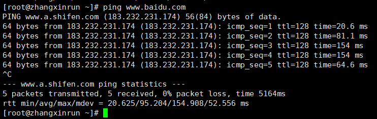

### 5、curl命令

- 基本语法：

  - curl [选项] url

    功能描述：**用来发送HTTP请求**

  - 选项：

    - -X：指定请求方式
    - -v：显示响应结果
    - -u：携带用户名/密码
    - -H：携带请求消息头信息

---

## 十六、Linux软件包管理

### 1、RPM包的管理

#### 1）介绍

> 一种用于互联网下载包的打包及安装工具，它包含在某些Linux分发版中。它生成具有.RPM扩展名的文件。**RPM是RedHat Package Manager（RedHat软件包管理工具）的缩写**，类似windows的setup.exe，这一文件格式名称虽然打上了RedHat的标志，但理念是通用的。Linux的分发版本都有采用（suse,redhat, centos等等），可以算是公认的行业标准了。

#### 2）RPM包的查询指令

- 基本语法：

  - ==rpm -qa==：查询所安装的所有软件包

    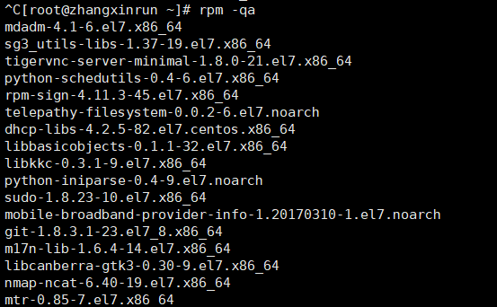

  - ==rpm -qa|more==：分页查询所安装的所有软件包

    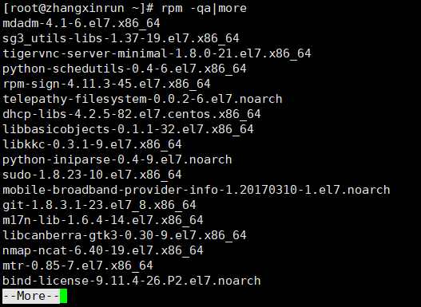

  - ==rpm -qa|grep xxx==：过滤查询安装的指定软件包

    - 例如：**rpm -qa|grep fire**

      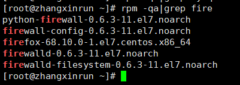

#### 3）RPM包的卸载指令

- 基本语法：

  - ==rpm -e [选项] 软件包名称==
    - 选项	--nodeps：表示强制删除，用于被删除的软件包所有依赖的情况

  

#### 4）RPM包的安装指令

- 基本语法：

  - ==rpm [选项] RPM包全路径名==
    - 选项：
      - -i=install	安装
      - -v=verbose	提示
      - -h=hash	进度条
    - 例如：**rpm -ivh firefox-68.10.0-1.el7.centos.x86_64.rpm**

- 操作步骤：

  - 在虚拟机上挂载centOS的iso文件

    

  - 在目录**/run/media/zhang/CentOS 7 x86_64/Packages**下找到对应的firefox安装包

    

    

  - 拷贝安装包到/opt目录下

    

  - 安装对应软件（firefox）

    

### 2、YUM包的管理：

#### 1）介绍：

> Yum 是一个Shell前端软件包管理器。基于RPM包管理，**能够从指定的服务器(在公网上)自动下载RPM包并且安装，可以自动处理依赖性关系，并且一次安装所有依赖的软件包**。
>
> - 注意：**使用YUM的前提是可以连接外网**

#### 2）YUM的查询指令

- 基本语法：

  - ==yum list |grep 软件包==：查询yum服务器上的软件包

    - 例如：**yum list |grep firefox**

      

#### 3）YUM包的安装指令

- 基本语法：

  - ==yum install 安装的包名==

    - 例如：**yum install firefox.x86_64**

      

#### 4）YUM包的卸载指令

- 基本语法：

  - ==yum remove 删除的包名==

    - 例如：**yum remove firefox.x86_64**

      

---

## 十七、搭建JavaEE部署环境

### 1、安装JDK

- 先将**jdk-8u121-linux-x64.tar.gz**通过xftp5上传到**/opt**下

  

- 解jdk压缩到**/opt**目录下

  

- 配置环境变量

  > 配置文件**/etc/profile**
  >
  > - JAVA_HOME=/opt/jdk1.8.0_121
  > - PATH=$JAVA_HOME/bin:$PATH
  > - CLASSPATH=$JAVA_HOME/lib:.
  > - export JAVA_HOME PATH CLASSPATH

  

  

- 使配置文件生效

  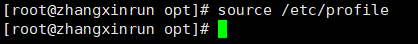

- 测试安装是否成功

  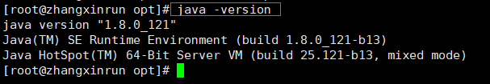

- 在目录/home/zhang下编写HelloWorld.java编译并运行

  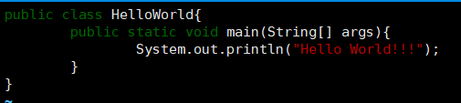

  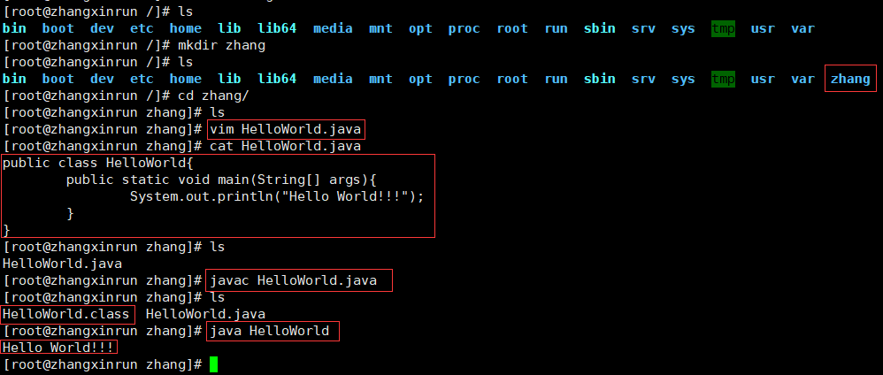

### 2、安装tomcat

- 配置防火墙开放tomcat端口：

  > ==/sbin/iptables -I INPUT -p tcp --dport 8080 -j ACCEPT==

- 先将**apache-tomcat-8.5.35.tar.gz**通过xftp5上传到**/opt**下

  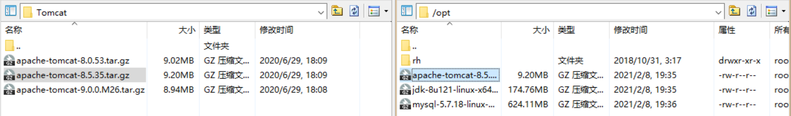

- 将tomcat解压到**/opt**

  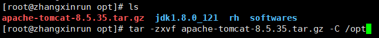

- 启动tomcat服务

  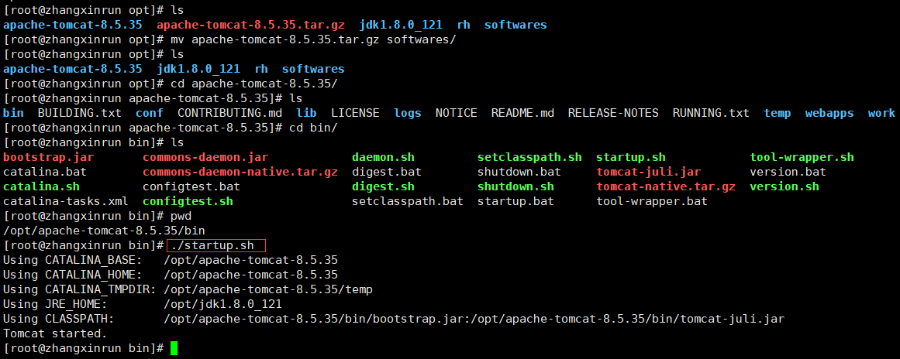

- Linux上访问tomcat

  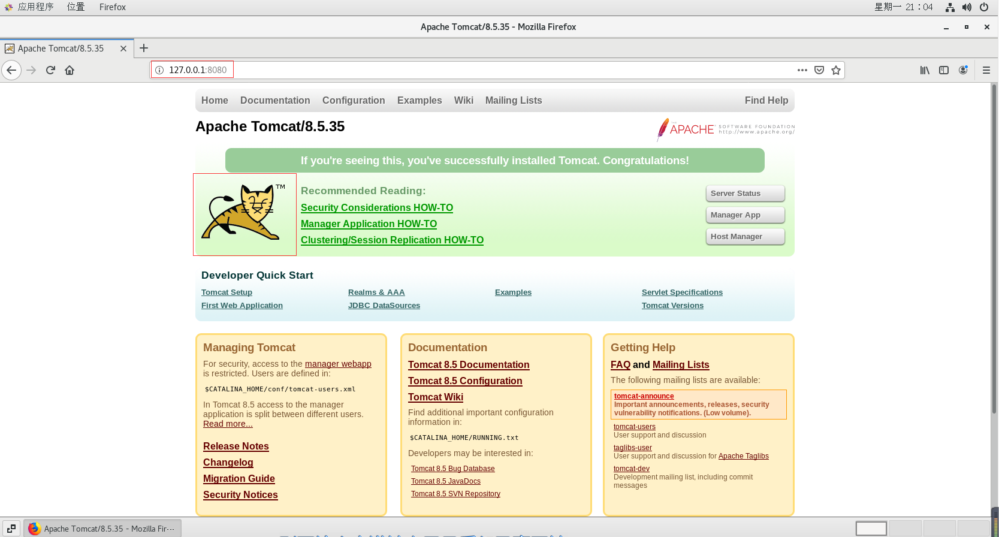

- 在Windows上访问tomcat

  > 注意：从其他计算机上访问需要先关闭Linux防火墙
  >
  > - 查看Linux防火墙状态：
  >
  >   > **systemctl status firewalld**
  >
  >   
  >
  > - 关闭Linux防护墙，再次查看防火墙是否已关闭：
  >
  >   > **systemctl stop firewalld**
  >
  >   

  

### 3、安装MySQL数据库

- 配置防火墙开放mysql端口：

  > ==iptables -A INPUT -m state --state NEW -m tcp -p tcp --dport 3306 -j ACCEPT==

- 查看是否已经安装了mariadb数据库

  > 检查Linux是否安装了mariadb数据库，mariadb数据库是MySQL的分支。是免费开源的，**mariadb和MySQL会有冲突**，首先要检查是否安装了mariadb数据库，如果已安装则先卸载掉mariadb数据库。
  >
  > - 检查命令：**yum list installed |grep mariadb**
  >
  >   
  >
  > - 卸载命令：**yum -y remove mariadb-libs.x86_64**
  >
  >   > 注意：如果卸载不成功，需要手动去掉参数-y，手动确认删除
  >
  >   
  >
  > - 再次查看是否存在mariadb数据库
  >
  >   > **yum list installed |grep mariadb**
  >
  >   

- 先将**mysql-5.7.18-linux-glibc2.5-x86_64.tar.gz**通过xftp5上传到**/opt**下

  

- 解压MySQL安装包到目录/opt下

  

- 修改解压后的根目录名

  

- 创建数据文件夹**data**

  > data文件夹是MySQL用来存放数据库文件的，**数据库中的表数据都存放在data目录下**
  >
  > 默认没有data目录，需要手动在**mysql-5.7.18**创建一个**data**目录

  

- 创建用来执行**mysqld**命令的Linux用户

  > 创建MySQL用户，用来执行MySQL的**mysqld**命令，此命令是用来初始化MySQL的基础信息

  

- 初始化MySQL

  > 使用MySQL的mysqld命令初始化数据库的基本信息，切换到**mysql-5.7.18/bin**目录下执行

  命令：

  - ./mysqld --initialize --user=mysql --datadir=/opt/mysql-5.7.18/data --basedir=/opt/mysql-5.7.18

    

  > 参数说明：
  >
  > - --initialize：初始化mysql，创建mysql的root, 随机生成密码。需要记住密码，在登录msyql使用
  > - --user：执行msyqld 命令的Linux用户名
  > - --datadir：mysql数据文件的存放位置，目录位置参照本机的设置
  > - --basedir：msyql安装程序的目录，目录位置参照本机的设置

  注意：**该命令执行后，会生成一个临时的mysql数据库root用户的密码，请先拷贝出来记住，后续第一次登录mysql需要使用**

  密码：**El!9%!krlAWC**（随机）

- 启用安全功能

  > 在服务器与客户机之间来回传输的所有数据进行加密。通过证书提供了身份验证机制，mysql命令程序**mysql_ssl_rsa_setup**提供了开启数据加密功能，生成数字证书

  在**mysql-5.7.18/bin**目录下执行命令：

  - ./mysql_ssl_rsa_setup --datadir=/opt/mysql-5.7.18/data

    

- 修改MySQL安装目录权限

  > MySQL安装后，需要更改mysql-5.7.18整个文件夹目录权限，更改所属的用户和组为之前创建的**mysql**用户及其所在组。在MySQL安装目录的上级（/opt）的位置，执行命令chown
  >
  > - 修改MySQL安装根目录所属用户和组：**chown -R mysql:mysql /opt/mysql-5.7.18**
  >
  >   
  >
  > - 修改MySQL安装目录的访问权限：**chmod 777 /opt/mysql-5.7.18**
  >
  >   

- 启动MySQL服务

  > 启动MySQL服务，mysql-5.7.18/bin目录下执行命令：

  - **./mysqld_safe &**（其中&符号表示后台启动，不指定则为前台启动）

    

- 查看MySQL是否启动成功，查看进程

  > **ps -ef |grep mysql**

  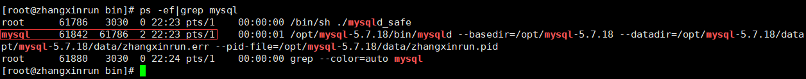

- 客户端登陆MySQL

  > 登陆进入MySQL，mysql-5.7.18/bin目录下执行命令：**./mysql -uroot -p**
  >
  > - -u表示使用root用户登录系统
  > - -p表示使用密码登录，使用之前生成的随机密码**El!9%!krlAWC**

  

- 修改root密码

  > 之前的root用户的密码是临时密码，需要修改之后才能使用
  >
  > 执行sql语句：show databases;	第一次使用将会提示修改MySQL的root用户密码

  

  修改MySQL的密码：

  - 命令：**alter user '用户名'@'主机域名或ip' identified by '新密码'**;
  - 例如：alter user 'root'@'localhost' identified by '123456';

  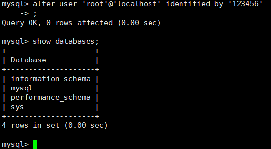

- 授权远程访问

  > - 授权远程访问，在没有授权之前只能在本机访问msyql，远程授权就是让其他计算机通过网络访问mysql（这样远程客户端才能访问）
  > - 授权命令:grant

  语法：**grant all privileges on \*.\* to root@'%' identified by '123456';**

  

  > 参数：
  >
  > - 其中\*.\* 的第一个*表示所有数据库名，第二个\*表示所有的数据库表；
  >
  > - root@'%' 中的root表示用户名
  >   - %表示ip地址，%也可以指定具体的ip地址，[比如root@localhost,root@192.168.235.130](mailto:比如root@localhost,root@192.168.235.130)等

- 更新权限信息，执行flush刷新权限：flush privileges;

  

- 关闭防火墙：

  > **systemctl stop firewalld**

  

- 远程链接数据库：

  

- 关闭mysql服务

  >  mysql-5.7.18/bin目录下执行：

  - **./mysqladmin -uroot -p shutdown**
  - 输入密码关闭

  

- 查看MySQL进程，已经关闭了mysqld_safe

  

- 修改数据库编码（可选）

  - 查看数据库编码：**show variables where Variable_name like '%char%';**

  

  - 可选修改编码：

    |   set character_set_client=utf8;   |
    | :--------------------------------: |
    | set character_set_connection=utf8; |
    |  set character_set_database=utf8;  |
    |  set character_set_results=utf8;   |
    |   set character_set_server=utf8;   |
    |   set character_set_system=utf8;   |
    |   set collation_connection=utf8;   |
    |    set collation_database=utf8;    |
    |     set collation_server=utf8;     |