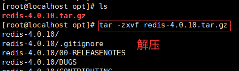
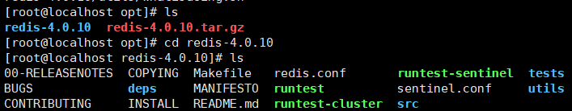
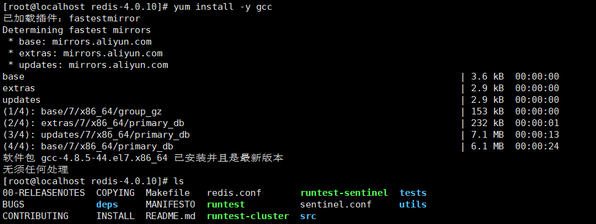
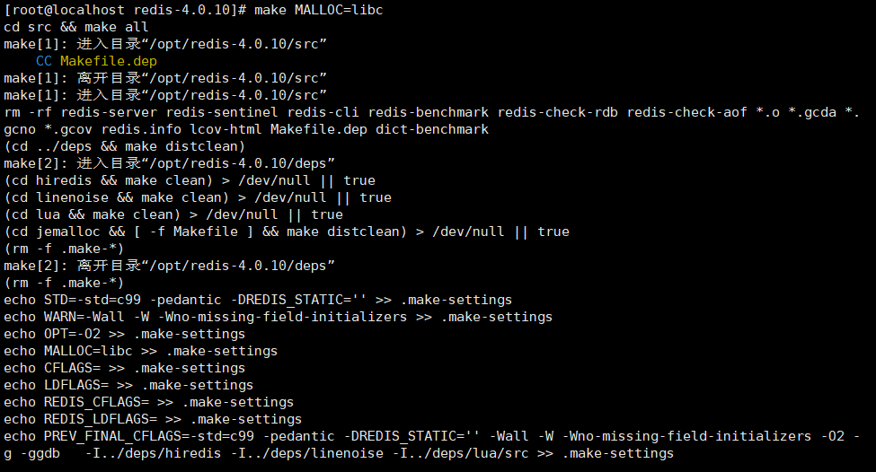
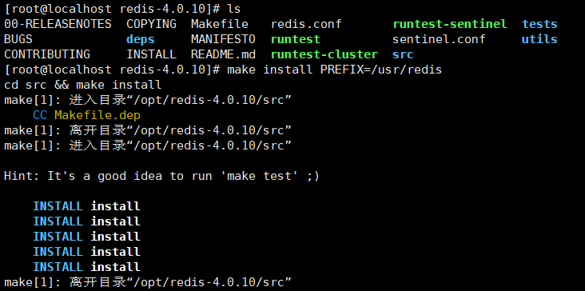
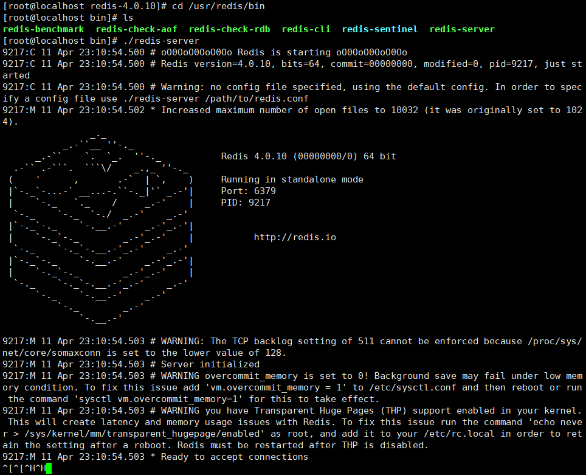
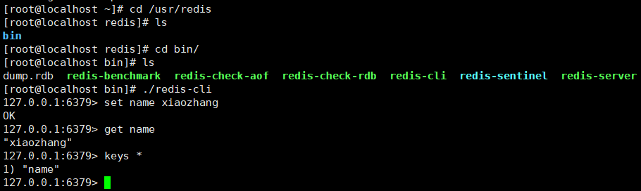
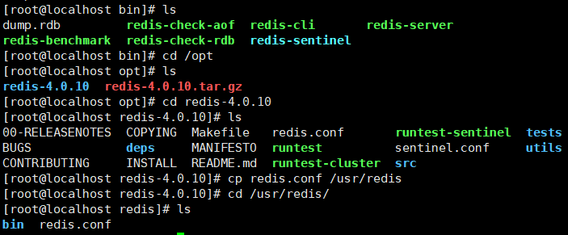

# Redis




















## 8. Redis数据库相关指令

### 8.1 数据库操作指令

```markdown
# 1.Redis中库说明
- 使用redis的默认配置器动redis服务后,默认会存在16个库,编号从0-15
- 可以使用select 库的编号 来选择一个redis的库

# 2.Redis中操作库的指令
- 清空当前的库  FLUSHDB
- 清空全部的库  FLUSHALL

# 3.redis客户端显示中文
-	./redis-cli  -p 7000 --raw
```

### 8.2 操作key相关指令

```markdown
# 1.DEL指令
- 语法 :  DEL key [key ...] 
- 作用 :  删除给定的一个或多个key 。不存在的key 会被忽略。
- 可用版本： >= 1.0.0
- 返回值： 被删除key 的数量。 

# 2.EXISTS指令
- 语法:  EXISTS key
- 作用:  检查给定key 是否存在。
- 可用版本： >= 1.0.0
- 返回值： 若key 存在，返回1 ，否则返回0。

# 3.EXPIRE
- 语法:  EXPIRE key seconds
- 作用:  为给定key 设置生存时间，当key 过期时(生存时间为0 )，它会被自动删除。
- 可用版本： >= 1.0.0
- 时间复杂度： O(1)
- 返回值：设置成功返回1 。

# 4.KEYS
- 语法 :  KEYS pattern
- 作用 :  查找所有符合给定模式pattern 的key 。
- 语法:
	KEYS * 匹配数据库中所有key 。
	KEYS h?llo 匹配hello ，hallo 和hxllo 等。
	KEYS h*llo 匹配hllo 和heeeeello 等。
	KEYS h[ae]llo 匹配hello 和hallo ，但不匹配hillo 。特殊符号用 "\" 隔开
- 可用版本： >= 1.0.0
- 返回值： 符合给定模式的key 列表。

# 5.MOVE
- 语法 :  MOVE key db
- 作用 :  将当前数据库的key 移动到给定的数据库db 当中。
- 可用版本： >= 1.0.0
- 返回值： 移动成功返回1 ，失败则返回0 。

# 6.PEXPIRE
- 语法 :  PEXPIRE key milliseconds
- 作用 :  这个命令和EXPIRE 命令的作用类似，但是它以毫秒为单位设置key 的生存时间，而不像EXPIRE 命令那样，以秒为单位。
- 可用版本： >= 2.6.0
- 时间复杂度： O(1)
- 返回值：设置成功，返回1  key 不存在或设置失败，返回0

# 7.PEXPIREAT
- 语法 :  PEXPIREAT key milliseconds-timestamp
- 作用 :  这个命令和EXPIREAT 命令类似，但它以毫秒为单位设置key 的过期unix 时间戳，而不是像EXPIREAT那样，以秒为单位。
- 可用版本： >= 2.6.0
- 返回值：如果生存时间设置成功，返回1 。当key 不存在或没办法设置生存时间时，返回0 。(查看EXPIRE 命令获取更多信息)

# 8.TTL
- 语法 :   TTL key
- 作用 :   以秒为单位，返回给定key 的剩余生存时间(TTL, time to live)。
- 可用版本： >= 1.0.0
- 返回值：
	当key 不存在时，返回-2 。
	当key 存在但没有设置剩余生存时间时，返回-1 。
	否则，以秒为单位，返回key 的剩余生存时间。
- Note : 在Redis 2.8 以前，当key 不存在，或者key 没有设置剩余生存时间时，命令都返回-1 。

# 9.PTTL
- 语法 :  PTTL key
- 作用 :  这个命令类似于TTL 命令，但它以毫秒为单位返回key 的剩余生存时间，而不是像TTL 命令那样，以秒为单位。
- 可用版本： >= 2.6.0
- 返回值： 当key 不存在时，返回-2 。当key 存在但没有设置剩余生存时间时，返回-1 。
- 否则，以毫秒为单位，返回key 的剩余生存时间。
- 注意 : 在Redis 2.8 以前，当key 不存在，或者key 没有设置剩余生存时间时，命令都返回-1 。

# 10.RANDOMKEY
- 语法 :  RANDOMKEY
- 作用 :  从当前数据库中随机返回(不删除) 一个key 。
- 可用版本： >= 1.0.0
- 返回值：当数据库不为空时，返回一个key 。当数据库为空时，返回nil 。

# 11.RENAME
- 语法 :  RENAME key newkey
- 作用 :  将key 改名为newkey 。当key 和newkey 相同，或者key 不存在时，返回一个错误。当newkey 已经存在时，RENAME 命令将覆盖旧值。
- 可用版本： >= 1.0.0
- 返回值： 改名成功时提示OK ，失败时候返回一个错误。

# 12.TYPE
- 语法 :  TYPE key
- 作用 :  返回key 所储存的值的类型。
- 可用版本： >= 1.0.0
- 返回值：
	none (key 不存在)
	string (字符串)
	list (列表)
	set (集合)
	zset (有序集)
	hash (哈希表)
```

### 8.3 String类型

#### 1. 内存存储模型


#### 2. 常用操作命令

| 命令                                       | 说明                                       |
| ------------------------------------------ | ------------------------------------------ |
| set                                        | 设置一个key/value                          |
| get                                        | 根据key获得对应的value                     |
| mset                                       | 一次设置多个key value                      |
| mget                                       | 一次获得多个key的value                     |
| getset                                     | 获得原始key的值，同时设置新值              |
| strlen                                     | 获得对应key存储value的长度                 |
| append                                     | 为对应key的value追加内容                   |
| getrange 索引0开始                         | 截取value的内容                            |
| setex                                      | 设置一个key存活的有效期（秒）              |
| psetex                                     | 设置一个key存活的有效期（毫秒）            |
| setnx                                      | 存在不做任何操作,不存在添加                |
| msetnx原子操作(只要有一个存在不做任何操作) | 可以同时设置多个key,只有有一个存在都不保存 |
| decr                                       | 进行数值类型的-1操作                       |
| decrby                                     | 根据提供的数据进行减法操作                 |
| Incr                                       | 进行数值类型的+1操作                       |
| incrby                                     | 根据提供的数据进行加法操作                 |
| Incrbyfloat                                | 根据提供的数据加入浮点数                   |

###  8.4 List类型

list 列表 相当于java中list 集合  特点  元素有序  且 可以重复

#### 1.内存存储模型


#### 2.常用操作指令

| 命令    | 说明                                 |
| ------- | ------------------------------------ |
| lpush   | 将某个值加入到一个key列表头部        |
| lpushx  | 同lpush,但是必须要保证这个key存在    |
| rpush   | 将某个值加入到一个key列表末尾        |
| rpushx  | 同rpush,但是必须要保证这个key存在    |
| lpop    | 返回和移除列表左边的第一个元素       |
| rpop    | 返回和移除列表右边的第一个元素       |
| lrange  | 获取某一个下标区间内的元素           |
| llen    | 获取列表元素个数                     |
| lset    | 设置某一个指定索引的值(索引必须存在) |
| lindex  | 获取某一个指定索引位置的元素         |
| lrem    | 从左到右删除重复元素                 |
| ltrim   | 保留列表中特定区间内的元素           |
| linsert | 在某一个元素之前，之后插入新元素     |

### 8.5 Set类型

特点: Set类型 Set集合 元素无序  不可以重复

#### 1.内存存储模型


#### 2.常用命令

| 命令        | 说明                                               |
| ----------- | -------------------------------------------------- |
| sadd        | 为集合添加元素                                     |
| smembers    | 显示集合中所有元素 无序                            |
| scard       | 返回集合中元素的个数                               |
| spop        | 随机返回一个元素 并将元素在集合中删除              |
| smove       | 从一个集合中向另一个集合移动元素  必须是同一种类型 |
| srem        | 从集合中删除一个元素                               |
| sismember   | 判断一个集合中是否含有这个元素                     |
| srandmember | 随机返回元素                                       |
| sdiff       | 去掉第一个集合中其它集合含有的相同元素             |
| sinter      | 求交集                                             |
| sunion      | 求和集                                             |

###  8.6 ZSet类型

特点: 可排序的set集合  排序  不可重复 

ZSET 官方  可排序SET  sortSet   

#### 1.内存模型


#### 2.常用命令

| 命令                       | 说明                         |
| -------------------------- | ---------------------------- |
| zadd                       | 添加一个有序集合元素         |
| zcard                      | 返回集合的元素个数           |
| zrange 升序 zrevrange 降序 | 返回一个范围内的元素         |
| zrangebyscore              | 按照分数查找一个范围内的元素 |
| zrank                      | 返回排名                     |
| zrevrank                   | 倒序排名                     |
| zscore                     | 显示某一个元素的分数         |
| zrem                       | 移除某一个元素               |
| zincrby                    | 给某个特定元素加分           |

###  8.7 hash类型

特点: value 是一个map结构 存在key value  key 无序的  

#### 1.内存模型


#### 2.常用命令

| 命令         | 说明                    |
| ------------ | ----------------------- |
| hset         | 设置一个key/value对     |
| hget         | 获得一个key对应的value  |
| hgetall      | 获得所有的key/value对   |
| hdel         | 删除某一个key/value对   |
| hexists      | 判断一个key是否存在     |
| hkeys        | 获得所有的key           |
| hvals        | 获得所有的value         |
| hmset        | 设置多个key/value       |
| hmget        | 获得多个key的value      |
| hsetnx       | 设置一个不存在的key的值 |
| hincrby      | 为value进行加法运算     |
| hincrbyfloat | 为value加入浮点值       |


