# Shiro

## 一、权限的管理

### 1、什么是权限管理

> ​		基本上涉及到用户参与的系统都要进行权限管理，权限管理属于系统安全的范畴，权限管理实现==对用户访问系统的控制==，按照安全规则或者安全策略控制用户可以访问而且只能访问自己被授权的资源。
>
> ​		权限管理包括==身份认证==和==授权==两部分，简称==认证授权==，对于需要访问控制的资源用户首先经过身份认证，认证通过后用户具有该资源的访问权限方可访问。

### 2、什么是身份认证

> ​		==身份认证==，就是判断一个用户是否为合法用户的处理过程，最常用的简单身份认证方式是系统通过核对用户输入的用户名和口令，看其是否与系统中存储的该用户的用户名和口令一致，来判断用户身份是否正确。对于采用指纹等系统，则出示指纹；对于硬件key等刷卡系统，则需要刷卡。

### 3、什么是授权

> ​		==授权==，即访问控制，控制谁能访问哪些资源。主体进行身份认证后需要分配权限方可访问系统的资源，对于某些资源没有权限是无法访问的。

## 二、什么是shiro

> ​	 **Apache Shiro™** is a powerful and easy-to-use Java security framework that performs authentication, authorization, cryptography, and session management. With Shiro’s easy-to-understand API, you can quickly and easily secure any application – from the smallest mobile applications to the largest web and enterprise applications. 

 	==**Apache Shiro™**是一个功能强大且易于使用的Java安全框架，用于执行身份验证，授权，加密和会话管理。使用Shiro易于理解的API，您可以快速轻松地保护任何应用程序，从最小的移动应用程序到最大的Web和企业应用程序。== 

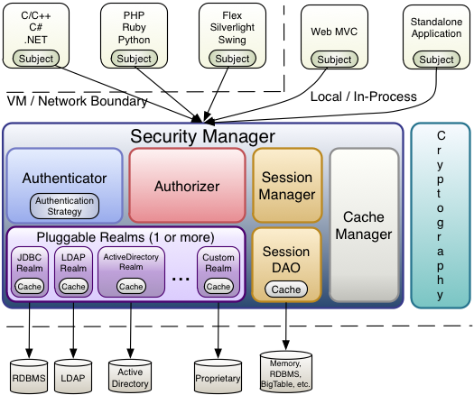

## 三、shiro的核心架构

- **Subject** ([`org.apache.shiro.subject.Subject`](http://shiro.apache.org/static/current/apidocs/org/apache/shiro/subject/Subject.html))
  A security-specific ‘view’ of the entity (user, 3rd-party service, cron job, etc) currently interacting with the software.
- **SecurityManager** ([org.apache.shiro.mgt.SecurityManager](http://shiro.apache.org/static/current/apidocs/org/apache/shiro/mgt/SecurityManager.html))
  As mentioned above, the `SecurityManager` is the heart of Shiro’s architecture. It is mostly an ‘umbrella’ object that coordinates its managed components to ensure they work smoothly together. It also manages Shiro’s view of every application user, so it knows how to perform security operations per user.
- **Authenticator** ([org.apache.shiro.authc.Authenticator](http://shiro.apache.org/static/current/apidocs/org/apache/shiro/authc/Authenticator.html))
  The `Authenticator` is the component that is responsible for executing and reacting to authentication (log-in) attempts by users. When a user tries to log-in, that logic is executed by the `Authenticator`. The `Authenticator` knows how to coordinate with one or more `Realms` that store relevant user/account information. The data obtained from these `Realms` is used to verify the user’s identity to guarantee the user really is who they say they are.
  - **Authentication Strategy** ([org.apache.shiro.authc.pam.AuthenticationStrategy](http://shiro.apache.org/static/current/apidocs/org/apache/shiro/authc/pam/AuthenticationStrategy.html))
    If more than one `Realm` is configured, the `AuthenticationStrategy` will coordinate the Realms to determine the conditions under which an authentication attempt succeeds or fails (for example, if one realm succeeds but others fail, is the attempt successful? Must all realms succeed? Only the first?).
- **Authorizer** ([org.apache.shiro.authz.Authorizer](http://shiro.apache.org/static/current/apidocs/org/apache/shiro/authz/Authorizer.html))
  The `Authorizer` is the component responsible determining users’ access control in the application. It is the mechanism that ultimately says if a user is allowed to do something or not. Like the `Authenticator`, the `Authorizer` also knows how to coordinate with multiple back-end data sources to access role and permission information. The `Authorizer` uses this information to determine exactly if a user is allowed to perform a given action.
- **SessionManager** ([org.apache.shiro.session.mgt.SessionManager](http://shiro.apache.org/static/current/apidocs/org/apache/shiro/session/mgt/SessionManager.html))
  The `SessionManager` knows how to create and manage user `Session` lifecycles to provide a robust Session experience for users in all environments. This is a unique feature in the world of security frameworks - Shiro has the ability to natively manage user Sessions in any environment, even if there is no Web/Servlet or EJB container available. By default, Shiro will use an existing session mechanism if available, (e.g. Servlet Container), but if there isn’t one, such as in a standalone application or non-web environment, it will use its built-in enterprise session management to offer the same programming experience. The `SessionDAO` exists to allow any datasource to be used to persist sessions.
  - **SessionDAO** ([org.apache.shiro.session.mgt.eis.SessionDAO](http://shiro.apache.org/static/current/apidocs/org/apache/shiro/session/mgt/eis/SessionDAO.html))
    The `SessionDAO` performs `Session` persistence (CRUD) operations on behalf of the `SessionManager`. This allows any data store to be plugged in to the Session Management infrastructure.
- **CacheManager** ([org.apache.shiro.cache.CacheManager](http://shiro.apache.org/static/current/apidocs/org/apache/shiro/cache/CacheManager.html))
  The `CacheManager` creates and manages `Cache` instance lifecycles used by other Shiro components. Because Shiro can access many back-end data sources for authentication, authorization and session management, caching has always been a first-class architectural feature in the framework to improve performance while using these data sources. Any of the modern open-source and/or enterprise caching products can be plugged in to Shiro to provide a fast and efficient user-experience.
- **Cryptography** ([org.apache.shiro.crypto.*](http://shiro.apache.org/static/current/apidocs/org/apache/shiro/crypto/package-summary.html))
  Cryptography is a natural addition to an enterprise security framework. Shiro’s `crypto` package contains easy-to-use and understand representations of crytographic Ciphers, Hashes (aka digests) and different codec implementations. All of the classes in this package are carefully designed to be very easy to use and easy to understand. Anyone who has used Java’s native cryptography support knows it can be a challenging animal to tame. Shiro’s crypto APIs simplify the complicated Java mechanisms and make cryptography easy to use for normal mortal human beings.
- **Realms** ([org.apache.shiro.realm.Realm](http://shiro.apache.org/static/current/apidocs/org/apache/shiro/realm/Realm.html))
  As mentioned above, Realms act as the ‘bridge’ or ‘connector’ between Shiro and your application’s security data. When it comes time to actually interact with security-related data like user accounts to perform authentication (login) and authorization (access control), Shiro looks up many of these things from one or more Realms configured for an application. You can configure as many `Realms` as you need (usually one per data source) and Shiro will coordinate with them as necessary for both authentication and authorization.

## 四、shiro中的认证

### 1、认证

> ​		身份认证，就是判断一个用户是否为合法的处理过程。最常用的简单身份认证方式是系统通过核对用户输入的用户名和口令，看其是否与系统中存储的该用户的用户名和口令一致，来判断用户身份是否正确。

### 2、shiro中认证的关键对象

- Subject：主体

  > ==访问系统的用户==，主体可以是用户、程序等，进行认证的都称为主体

- Principal：身份信息

  > 是主体（Subject）进行==身份认证的标识==，标识必须具有唯一性，如用户名、手机号、邮箱地址等，一个主体可以有多个身份，但是必须有一个主身份（Primary Principal）

- Credential：凭证信息

  > 是==只有主体自己知道的安全信息==，如密码、证书等

### 3、认证流程

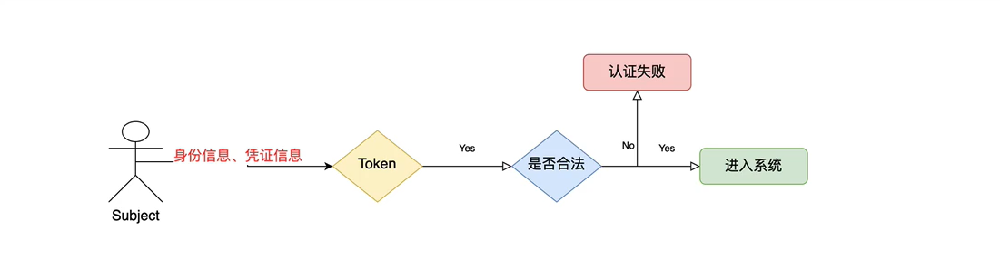

### 4、认证的开发

- 创建maven项目（普通Java工程）

  ```xml
  <!--引入shiro依赖-->
  <dependency>    
      <groupId>org.apache.shiro</groupId>    
      <artifactId>shiro-core</artifactId>    
      <version>1.5.3</version>
  </dependency>
  ```

- 引入shiro配置文件并加入如下配置

  ```ini
  [users]
  xiaozhang=123
  ```

- 开发认证代码

  ```java
  import org.apache.shiro.SecurityUtils;
  import org.apache.shiro.authc.IncorrectCredentialsException;
  import org.apache.shiro.authc.UnknownAccountException;
  import org.apache.shiro.authc.UsernamePasswordToken;
  import org.apache.shiro.mgt.DefaultSecurityManager;
  import org.apache.shiro.mgt.SecurityManager;
  import org.apache.shiro.realm.text.IniRealm;
  import org.apache.shiro.subject.Subject;
  
  public class MyAuthenticator {
      public static void main(String[] args) {
          //1、创建安全管理器对象
          SecurityManager securityManager = new DefaultSecurityManager();
          //2、给安全管理器设置realm
          ((DefaultSecurityManager) securityManager).setRealm(new IniRealm("classpath:shiro.ini"));
          //3、SecurityUtils 给全局的安全工具类设置安全管理器
          SecurityUtils.setSecurityManager(securityManager);
          //4、关键对象 subject 主体
          Subject subject = SecurityUtils.getSubject();
          //5、创建令牌
          UsernamePasswordToken token = new UsernamePasswordToken("xiaozhang","123");
          try{
              System.out.println("认证前，认证状态：" + subject.isAuthenticated());
              subject.login(token);    //用户认证
              System.out.println("认证后，认证状态：" + subject.isAuthenticated());
          }catch (UnknownAccountException e){
              e.printStackTrace();
              System.out.println("认证失败：用户名不存在...");  // UnknownAccountException
          }catch (IncorrectCredentialsException e){
              e.printStackTrace();
              System.out.println("认证失败：密码错误...");    // IncorrectCredentialsException
          }
      }
  }
  
  ```

## 五、自定义Realm

### 1、shiro提供的Realm

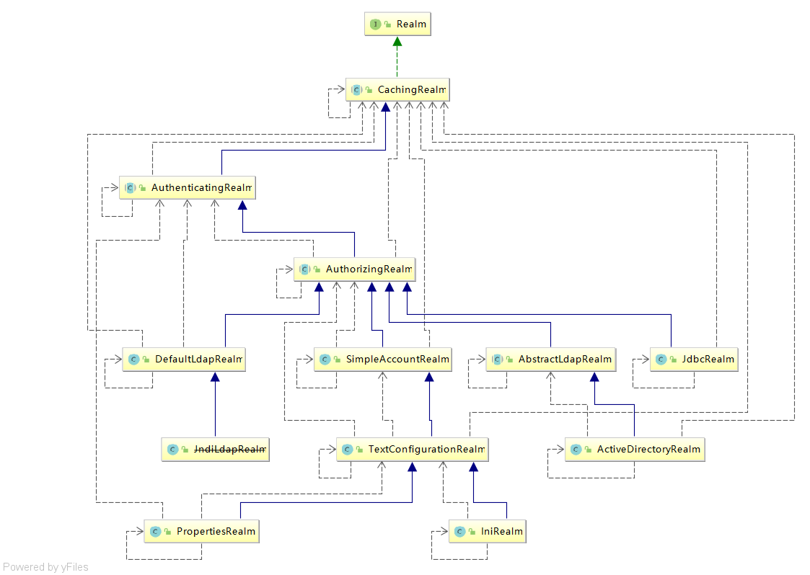

### 2、根据认证源码认证使用的是SimpleAccountReaml

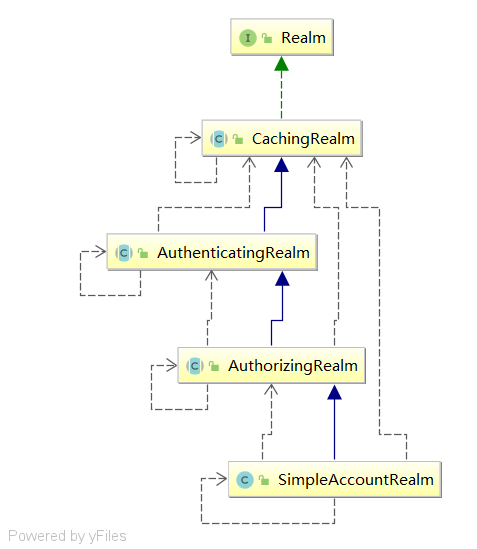

> ​	SimpleAccountRealm的部分源码中有两个方法：==一个是认证，一个是授权；==是通过继承AuthenticatingRealm和AuthorizingRealm得来的，所以编写自定义的Realm时，可以直接继承AuthorizingRealm抽象类即可，这样继承的话，就可以同时在自定义的Realm中编写认证和授权的代码

### 3、自定义realm开发

- 使用自定义的realm

```java
import com.zhang.realm.CustomerRealm;
import org.apache.shiro.SecurityUtils;
import org.apache.shiro.authc.IncorrectCredentialsException;
import org.apache.shiro.authc.UnknownAccountException;
import org.apache.shiro.authc.UsernamePasswordToken;
import org.apache.shiro.mgt.DefaultSecurityManager;
import org.apache.shiro.subject.Subject;

/**
 * 使用自定义Realm
 */
public class TestCustomerAuthorizingRealm {
    public static void main(String[] args) {
        //创建securityManager
        DefaultSecurityManager defaultSecurityManager = new DefaultSecurityManager();
        //设置自定义realm
        defaultSecurityManager.setRealm(new CustomerRealm());
        //设置安全管理器
        SecurityUtils.setSecurityManager(defaultSecurityManager);
        //通过安全工具获取subject
        Subject subject = SecurityUtils.getSubject();
        //创建token
        UsernamePasswordToken token = new UsernamePasswordToken("xiaozhang","123");
        try{
            subject.login(token);
        }catch (UnknownAccountException e){
            e.printStackTrace();
            System.out.println("用户名错误");
        }catch (IncorrectCredentialsException e){
            e.printStackTrace();
            System.out.println("密码错误");
        }
    }
}

```

- 自定义realm实现

```java
import org.apache.shiro.authc.AuthenticationException;
import org.apache.shiro.authc.AuthenticationInfo;
import org.apache.shiro.authc.AuthenticationToken;
import org.apache.shiro.authc.SimpleAuthenticationInfo;
import org.apache.shiro.authz.AuthorizationInfo;
import org.apache.shiro.realm.AuthorizingRealm;
import org.apache.shiro.subject.PrincipalCollection;

/**
 * 自定义realm实现   将认证/授权数据的来源转为数据库的实现
 */
public class CustomerRealm extends AuthorizingRealm {
    //授权
    @Override
    protected AuthorizationInfo doGetAuthorizationInfo(PrincipalCollection principals) {
        return null;
    }

    //认证
    @Override
    protected AuthenticationInfo doGetAuthenticationInfo(AuthenticationToken token) throws AuthenticationException {
        // 在token中获取用户名
        String principal = (String) token.getPrincipal();
        System.out.println("用户名 = " + principal);
        //根据身份信息使用jdbc  mybatis查询相关数据库
        if("xiaozhang".equals(principal)){
            // 参数1：返回数据库中的用户名   
            // 参数2：返回数据库中的正确密码     
            // 参数3：提供当前realm的名字    this.getName();
            SimpleAuthenticationInfo simpleAuthenticationInfo = new SimpleAuthenticationInfo(principal,"123",this.getName());
            return simpleAuthenticationInfo;
        }
        return null;
    }
}
```

## 六、MD5算法

### 1、MD5算法的基本使用

- 普通md5算法

```java
import org.apache.shiro.crypto.hash.Md5Hash;

public class TestShiroMD5 {
    public static void main(String[] args) {
        //创建一个md5算法
        //普通md5算法
        Md5Hash md5Hash = new Md5Hash("123");
        String s = md5Hash.toHex();//转换为16进制
        System.out.println("md5算法 = " + s);   //202cb962ac59075b964b07152d234b70
    }
}
```

- 使用MD5 + salt处理

```java
import org.apache.shiro.crypto.hash.Md5Hash;

public class TestShiroMD5 {
    public static void main(String[] args) {
        //使用MD5 + salt处理
        Md5Hash md5Hash1 = new Md5Hash("123","X0*7pd");
        System.out.println("使用MD5 + salt处理 = " + md5Hash1.toHex());     //1e680a7d41bd4e51951d9a049b09409f
    }
}
```

- 使用MD5 + salt + hash散列

```java
import org.apache.shiro.crypto.hash.Md5Hash;

public class TestShiroMD5 {
    public static void main(String[] args) {
        //使用MD5 + salt + hash散列
        Md5Hash md5Hash2 = new Md5Hash("123","X0*7pd",1024);
        System.out.println("使用MD5 + salt + hash散列 = " + md5Hash2.toHex());  //d093bbd2eeba922b875c4dd2dfc695dc
    }
}
```

### 2、MD5算法认证方式实现

- 普通md5算法

```java
import com.zhang.realm.CustomerMD5Realm;
import org.apache.shiro.SecurityUtils;
import org.apache.shiro.authc.IncorrectCredentialsException;
import org.apache.shiro.authc.UnknownAccountException;
import org.apache.shiro.authc.UsernamePasswordToken;
import org.apache.shiro.authc.credential.HashedCredentialsMatcher;
import org.apache.shiro.mgt.DefaultSecurityManager;
import org.apache.shiro.subject.Subject;

public class TestCustomerMD5RealmAuthenicator {
    public static void main(String[] args) {
        //创建安全管理器
        DefaultSecurityManager defaultSecurityManager = new DefaultSecurityManager();
        //注入realm
        CustomerMD5Realm realm = new CustomerMD5Realm();
        //设置realm使用的hash凭证匹配器
        defaultSecurityManager.setRealm(realm);
        //将安全管理器注入安全工具
        SecurityUtils.setSecurityManager(defaultSecurityManager);
        //通过安全工具获取subject
        Subject subject = SecurityUtils.getSubject();
        //认证
        UsernamePasswordToken token = new UsernamePasswordToken("xiaozhang","123");
        try {
            subject.login(token);
            System.out.println("登录成功");
        }catch (UnknownAccountException e){
            e.printStackTrace();
            System.out.println("用户名错误");
        }catch (IncorrectCredentialsException e){
            e.printStackTrace();
            System.out.println("密码错误");
        }
    }
}
```

> 自定义的Realm类

```java
import org.apache.shiro.authc.AuthenticationException;
import org.apache.shiro.authc.AuthenticationInfo;
import org.apache.shiro.authc.AuthenticationToken;
import org.apache.shiro.authc.SimpleAuthenticationInfo;
import org.apache.shiro.authz.AuthorizationInfo;
import org.apache.shiro.realm.AuthorizingRealm;
import org.apache.shiro.subject.PrincipalCollection;
import org.apache.shiro.util.ByteSource;

public class CustomerMD5Realm extends AuthorizingRealm {
    //授权
    @Override
    protected AuthorizationInfo doGetAuthorizationInfo(PrincipalCollection principals) {
        return null;
    }

    //认证
    @Override
    protected AuthenticationInfo doGetAuthenticationInfo(AuthenticationToken token) throws AuthenticationException {
        String principal = (String) token.getPrincipal();
        if("xiaozhang".equals(principal)){
            // 使用md5算法
            SimpleAuthenticationInfo simpleAuthenticationInfo = new SimpleAuthenticationInfo(principal,"202cb962ac59075b964b07152d234b70",this.getName
            return simpleAuthenticationInfo;
        }
        return null;
    }
}
```

- 使用MD5 + salt处理

```java
import com.zhang.realm.CustomerMD5Realm;
import org.apache.shiro.SecurityUtils;
import org.apache.shiro.authc.IncorrectCredentialsException;
import org.apache.shiro.authc.UnknownAccountException;
import org.apache.shiro.authc.UsernamePasswordToken;
import org.apache.shiro.authc.credential.HashedCredentialsMatcher;
import org.apache.shiro.mgt.DefaultSecurityManager;
import org.apache.shiro.subject.Subject;

public class TestCustomerMD5RealmAuthenicator {
    public static void main(String[] args) {
        //创建安全管理器
        DefaultSecurityManager defaultSecurityManager = new DefaultSecurityManager();
        //注入realm
        CustomerMD5Realm realm = new CustomerMD5Realm();
        //设置realm使用的hash凭证匹配器
        HashedCredentialsMatcher credentialsMatcher = new HashedCredentialsMatcher();
        // 指定哪种算法
        credentialsMatcher.setHashAlgorithmName("md5");
        realm.setCredentialsMatcher(credentialsMatcher);
        defaultSecurityManager.setRealm(realm);
        //将安全管理器注入安全工具
        SecurityUtils.setSecurityManager(defaultSecurityManager);
        //通过安全工具获取subject
        Subject subject = SecurityUtils.getSubject();
        //认证
        UsernamePasswordToken token = new UsernamePasswordToken("xiaozhang","123");
        try {
            subject.login(token);
            System.out.println("登录成功");
        }catch (UnknownAccountException e){
            e.printStackTrace();
            System.out.println("用户名错误");
        }catch (IncorrectCredentialsException e){
            e.printStackTrace();
            System.out.println("密码错误");
        }
    }
}
```

> 自定义的Realm类

```java
import org.apache.shiro.authc.AuthenticationException;
import org.apache.shiro.authc.AuthenticationInfo;
import org.apache.shiro.authc.AuthenticationToken;
import org.apache.shiro.authc.SimpleAuthenticationInfo;
import org.apache.shiro.authz.AuthorizationInfo;
import org.apache.shiro.realm.AuthorizingRealm;
import org.apache.shiro.subject.PrincipalCollection;
import org.apache.shiro.util.ByteSource;

public class CustomerMD5Realm extends AuthorizingRealm {
    //授权
    @Override
    protected AuthorizationInfo doGetAuthorizationInfo(PrincipalCollection principals) {
        return null;
    }

    //认证
    @Override
    protected AuthenticationInfo doGetAuthenticationInfo(AuthenticationToken token) throws AuthenticationException {
        String principal = (String) token.getPrincipal();
        if("xiaozhang".equals(principal)){
            // 使用md5算法 + salt
            SimpleAuthenticationInfo simpleAuthenticationInfo = new SimpleAuthenticationInfo(principal,"1e680a7d41bd4e51951d9a049b09409f",
                     ByteSource.Util.bytes("X0*7pd"),this.getName());
            return simpleAuthenticationInfo;
        }
        return null;
    }
}
```

- 使用MD5 + salt + hash散列

```java
import com.zhang.realm.CustomerMD5Realm;
import org.apache.shiro.SecurityUtils;
import org.apache.shiro.authc.IncorrectCredentialsException;
import org.apache.shiro.authc.UnknownAccountException;
import org.apache.shiro.authc.UsernamePasswordToken;
import org.apache.shiro.authc.credential.HashedCredentialsMatcher;
import org.apache.shiro.mgt.DefaultSecurityManager;
import org.apache.shiro.subject.Subject;

public class TestCustomerMD5RealmAuthenicator {
    public static void main(String[] args) {
        //创建安全管理器
        DefaultSecurityManager defaultSecurityManager = new DefaultSecurityManager();
        //注入realm
        CustomerMD5Realm realm = new CustomerMD5Realm();
        HashedCredentialsMatcher credentialsMatcher = new HashedCredentialsMatcher();
        // 指定哪种算法
        credentialsMatcher.setHashAlgorithmName("md5");
        // 设置散列次数
        credentialsMatcher.setHashIterations(1024);
        //设置realm使用的hash凭证匹配器
        realm.setCredentialsMatcher(credentialsMatcher);
        defaultSecurityManager.setRealm(realm);
        //将安全管理器注入安全工具
        SecurityUtils.setSecurityManager(defaultSecurityManager);
        //通过安全工具获取subject
        Subject subject = SecurityUtils.getSubject();

        //认证
        UsernamePasswordToken token = new UsernamePasswordToken("xiaozhang","123");
        try {
            subject.login(token);
            System.out.println("登录成功");
        }catch (UnknownAccountException e){
            e.printStackTrace();
            System.out.println("用户名错误");
        }catch (IncorrectCredentialsException e){
            e.printStackTrace();
            System.out.println("密码错误");
        }
    }
}
```

> 自定义的Realm类

```java
import org.apache.shiro.authc.AuthenticationException;
import org.apache.shiro.authc.AuthenticationInfo;
import org.apache.shiro.authc.AuthenticationToken;
import org.apache.shiro.authc.SimpleAuthenticationInfo;
import org.apache.shiro.authz.AuthorizationInfo;
import org.apache.shiro.realm.AuthorizingRealm;
import org.apache.shiro.subject.PrincipalCollection;
import org.apache.shiro.util.ByteSource;

public class CustomerMD5Realm extends AuthorizingRealm {
    //授权
    @Override
    protected AuthorizationInfo doGetAuthorizationInfo(PrincipalCollection principals) {
        return null;
    }

    //认证
    @Override
    protected AuthenticationInfo doGetAuthenticationInfo(AuthenticationToken token) throws AuthenticationException {
        String principal = (String) token.getPrincipal();
        if("xiaozhang".equals(principal)){
            // 使用md5算法 + salt + hash散列
            SimpleAuthenticationInfo simpleAuthenticationInfo = new SimpleAuthenticationInfo(principal,"d093bbd2eeba922b875c4dd2dfc695dc",
                    ByteSource.Util.bytes("X0*7pd"),this.getName());
            return simpleAuthenticationInfo;
        }
        return null;
    }
}
```

## 七、shiro的授权

### 1、授权

> ​		授权，即==访问控制==，控制谁能访问哪些资源。主体进行身份认证后需要分配权限方可访问系统的资源，对于某些资源没有权限是没法访问的。

### 2、关键对象

> ==授权可简单理解为who对what（which）进行how操作==

- ==Who，即主体（Subject）==，主体需要访问系统中的资源
- ==What，即资源（Resource）==，如系统菜单、页面、按钮、类方法、系统商品信息等。资源包括==资源类型==和==资源实例==
- ==How，权限/许可（Permission）==，规定了主体对资源的操作许可，权限离开资源没有意义，如用户查询权限、用户添加权限、某个类方法的调用权限，通过权限可知主体对哪些资源都有哪些操作许可。

### 3、授权的流程

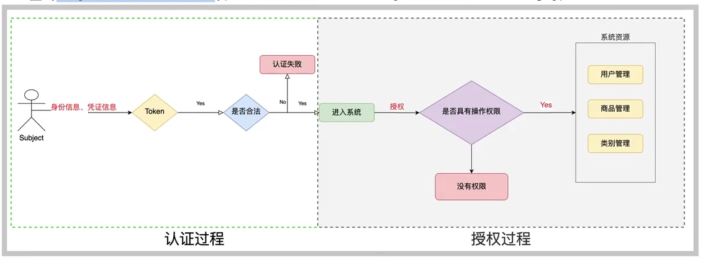

### 4、授权方式

- 基于角色的访问控制

  - RBAC基于角色的访问控制（Role-Based Access Control）是以角色为中心进行范围控制

    ```java
    if(subject.hasRole("admin")){
        //操作什么资源
    }
    ```

- 基于资源的访问控制

  - RBAC基于资源的访问控制（Resource-Based Access Control）是以资源为中心进行访问控制

    ```java
    if(subject.isPermission("user:*:create")){
        //对所有用户具有创建
    }
    ```

### 5、权限字符串

> ​		权限字符串规则是：**==资源修饰符：操作：资源实例==**标识符，意思是对哪个资源的哪个实例具有什么操作，“：”是资源/操作/实例的分隔符，权限字符串也可以使用“*”通配符

- 例子：
  - 用户创建权限：`user:create`，或`user:create:*`
  - 用户修改实例001的权限：`user:update:001`
  - 用户实例001的所有权限：`user:*:001`

### 6、shiro中权限编程实现方式

- 编程式

  ```java
  Subject subject = SecurityUtils.getSubject();
  if(subject.hasRole("admin")){
      //有权限
  }else{
      //无权限
  }
  ```

- 注解式

  ```java
  @RequiresRoles("admin")
  public void hello(){
      //有权限
  }
  ```

- 标签式

  ```xml
  JSP/GSP	标签：在JSP/GSP页面通过相应的标签完成
  <shiro:hasRole name="admin">
  	<!--有权限-->
  </shiro>
  注意：Thymeleaf中使用shiro需要额外集成！
  ```

## 八、shiro整合springboot之环境搭建

### 1、整合思路

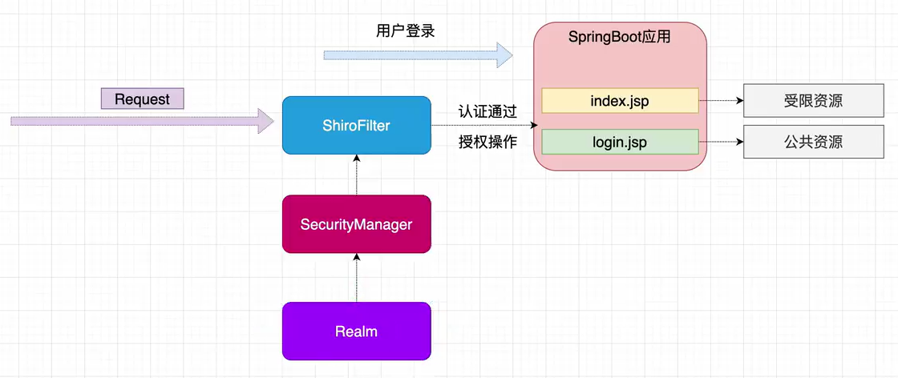

### 2、配置环境

- 创建项目

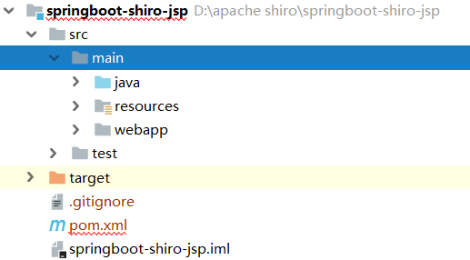

- 引入依赖

  ```xml
  <!--引入JSP解析依赖-->
  <dependency>
       <groupId>org.apache.tomcat.embed</groupId>
       <artifactId>tomcat-embed-jasper</artifactId>
  </dependency>
  <!--引入jstl标签库依赖-->
  <dependency>
       <groupId>jstl</groupId>
       <artifactId>jstl</artifactId>
       <version>1.2</version>
  </dependency>
  <!--引入shiro整合Springboot依赖-->
  <dependency>
    <groupId>org.apache.shiro</groupId>
    <artifactId>shiro-spring-boot-starter</artifactId>
    <version>1.5.3</version>
  </dependency>
  ```

- 修改视图

  ```properties
  server.port=8080
  server.servlet.context-path=/shiro
  spring.application.name=shiro
  
  spring.mvc.view.prefix=/
  spring.mvc.view.suffix=.jsp
  ```

- 修改配置（ JSP 与IDEA 与SpringBoot存在一定的**不兼容**，修改此配置即可解决 ）

  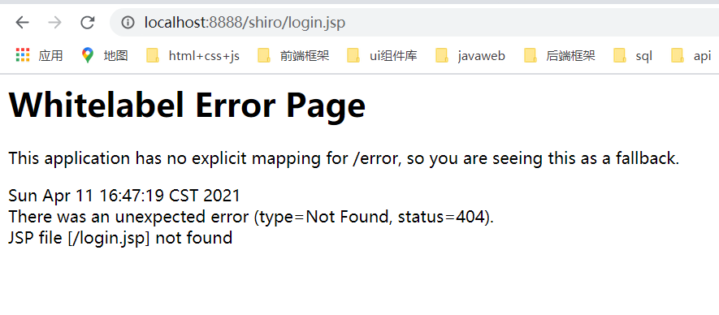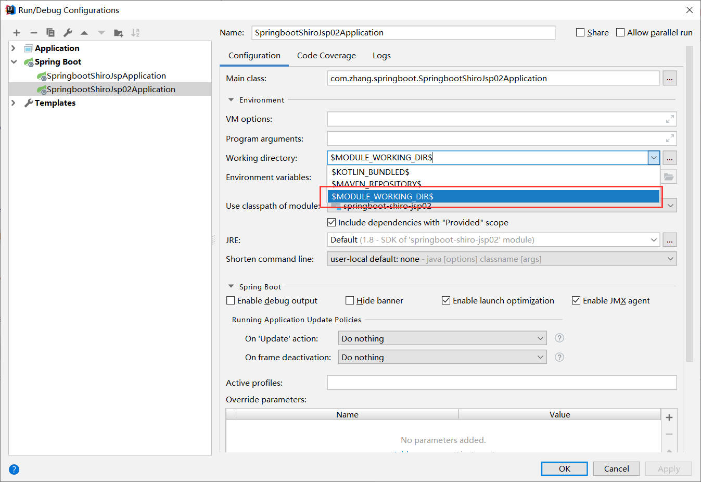

### 3、整合使用

- 数据库设计

  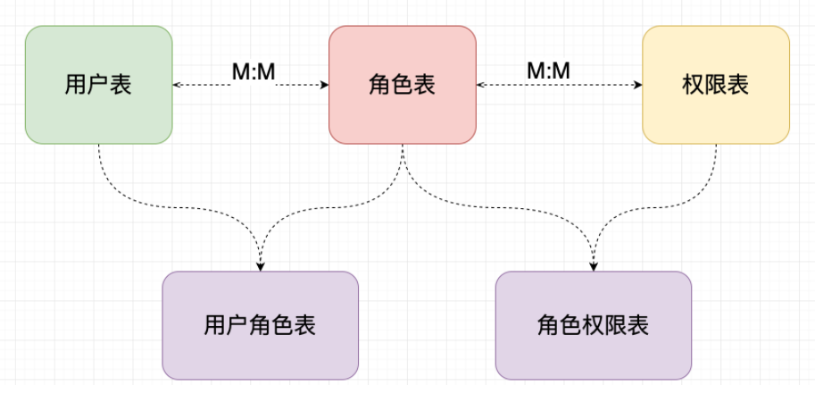

- 数据库实现（数据库：==shiro==）

  ```sql
  /*
  Navicat MySQL Data Transfer
  
  Source Server         : windows
  Source Server Version : 50537
  Source Host           : localhost:3306
  Source Database       : shiro
  
  Target Server Type    : MYSQL
  Target Server Version : 50537
  File Encoding         : 65001
  
  Date: 2021-04-11 18:13:00
  */
  
  SET FOREIGN_KEY_CHECKS=0;
  
  -- ----------------------------
  -- Table structure for t_perm
  -- ----------------------------
  DROP TABLE IF EXISTS `t_perm`;
  CREATE TABLE `t_perm` (
    `id` int(32) NOT NULL,
    `perm_name` varchar(80) DEFAULT NULL,
    `url` varchar(255) DEFAULT NULL,
    PRIMARY KEY (`id`)
  ) ENGINE=InnoDB DEFAULT CHARSET=utf8mb4;
  
  -- ----------------------------
  -- Records of t_perm
  -- ----------------------------
  INSERT INTO `t_perm` VALUES ('1', 'user:*:*', null);
  INSERT INTO `t_perm` VALUES ('2', 'product:*:01', null);
  
  -- ----------------------------
  -- Table structure for t_role
  -- ----------------------------
  DROP TABLE IF EXISTS `t_role`;
  CREATE TABLE `t_role` (
    `id` int(11) NOT NULL,
    `role_name` varchar(80) DEFAULT NULL,
    PRIMARY KEY (`id`)
  ) ENGINE=InnoDB DEFAULT CHARSET=utf8mb4;
  
  -- ----------------------------
  -- Records of t_role
  -- ----------------------------
  INSERT INTO `t_role` VALUES ('1', 'admin');
  INSERT INTO `t_role` VALUES ('2', 'user');
  INSERT INTO `t_role` VALUES ('3', 'product');
  
  -- ----------------------------
  -- Table structure for t_role_perm
  -- ----------------------------
  DROP TABLE IF EXISTS `t_role_perm`;
  CREATE TABLE `t_role_perm` (
    `id` int(32) NOT NULL,
    `role_id` int(32) DEFAULT NULL,
    `perm_id` int(32) DEFAULT NULL,
    PRIMARY KEY (`id`)
  ) ENGINE=InnoDB DEFAULT CHARSET=utf8mb4;
  
  -- ----------------------------
  -- Records of t_role_perm
  -- ----------------------------
  INSERT INTO `t_role_perm` VALUES ('1', '1', '1');
  INSERT INTO `t_role_perm` VALUES ('2', '1', '2');
  INSERT INTO `t_role_perm` VALUES ('3', '2', '1');
  INSERT INTO `t_role_perm` VALUES ('4', '3', '2');
  
  -- ----------------------------
  -- Table structure for t_user
  -- ----------------------------
  DROP TABLE IF EXISTS `t_user`;
  CREATE TABLE `t_user` (
    `id` int(11) NOT NULL AUTO_INCREMENT,
    `username` varchar(50) DEFAULT NULL,
    `password` varchar(50) DEFAULT NULL,
    `salt` varchar(50) DEFAULT NULL,
    PRIMARY KEY (`id`)
  ) ENGINE=InnoDB AUTO_INCREMENT=9 DEFAULT CHARSET=utf8mb4;
  
  -- ----------------------------
  -- Records of t_user
  -- ----------------------------
  INSERT INTO `t_user` VALUES ('1', 'xiaozhang', '7dce0b387c07fd150d9352b3bd40808e', '%fFhi(5T');
  INSERT INTO `t_user` VALUES ('2', 'xiaohuang', '654428c3de3de65f782f502104be20b1', '@Xm3WcN*');
  
  -- ----------------------------
  -- Table structure for t_user_role
  -- ----------------------------
  DROP TABLE IF EXISTS `t_user_role`;
  CREATE TABLE `t_user_role` (
    `id` int(32) NOT NULL,
    `user_id` int(32) DEFAULT NULL,
    `role_id` int(32) DEFAULT NULL,
    PRIMARY KEY (`id`)
  ) ENGINE=InnoDB DEFAULT CHARSET=utf8mb4;
  
  -- ----------------------------
  -- Records of t_user_role
  -- ----------------------------
  INSERT INTO `t_user_role` VALUES ('1', '1', '1');
  INSERT INTO `t_user_role` VALUES ('2', '2', '2');
  INSERT INTO `t_user_role` VALUES ('3', '2', '3');
  INSERT INTO `t_user_role` VALUES ('4', '1', '2');
  ```

- 数据库文件结构

  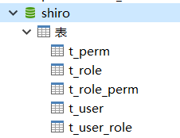

- 创建配置类（ ==用来整合shiro框架相关的配置类== ）

  ```java
  package com.zhang.springboot.config;
  
  import com.zhang.springboot.realm.CustomerRealm;
  import org.apache.shiro.authc.credential.HashedCredentialsMatcher;
  import org.apache.shiro.realm.Realm;
  import org.apache.shiro.spring.web.ShiroFilterFactoryBean;
  import org.apache.shiro.web.mgt.DefaultWebSecurityManager;
  import org.springframework.context.annotation.Bean;
  import org.springframework.context.annotation.Configuration;
  
  import java.util.HashMap;
  import java.util.Map;
  
  /**
   * 用来整合shiro框架的相关配置
   */
  @Configuration
  public class ShiroConfig {
  
      // 1、创建shiroFilter      负责拦截所有请求
      @Bean
      public ShiroFilterFactoryBean getShiroFilterFactoryBean(DefaultWebSecurityManager defaultWebSecurityManager){
          ShiroFilterFactoryBean shiroFilterFactoryBean = new ShiroFilterFactoryBean();
  
          //给Filter设置安全管理器
          shiroFilterFactoryBean.setSecurityManager(defaultWebSecurityManager);
  		//配置系统的公共资源
          Map<String ,String> map = new HashMap<>();
          map.put("/user/login","anon");   //anon：设置为公共资源
          map.put("/user/register","anon");
          map.put("/register.jsp","anon");
  
          //配置系统的受限资源
          map.put("/**","authc"); //authc：表示请求这个资源需要认证和授权
  
          //默认认证界面路径--->login.jsp
          shiroFilterFactoryBean.setLoginUrl("/login.jsp");
          shiroFilterFactoryBean.setFilterChainDefinitionMap(map);
  
          return shiroFilterFactoryBean;
      }
  
      // 2、创建安全管理器
      @Bean
      public DefaultWebSecurityManager getDefaultWebSecurityManager(Realm realm){
          DefaultWebSecurityManager defaultWebSecurityManager = new DefaultWebSecurityManager();
  
          //给安全管理器设置Realm
          defaultWebSecurityManager.setRealm(realm);
  
          return defaultWebSecurityManager;
      }
  
      // 3、创建自定义Realm
      @Bean
      public Realm getRealm(){
          CustomerRealm customerRealm = new CustomerRealm();
  
          HashedCredentialsMatcher hashedCredentialsMatcher = new HashedCredentialsMatcher();
          hashedCredentialsMatcher.setHashAlgorithmName("md5");
          hashedCredentialsMatcher.setHashIterations(1024);
          customerRealm.setCredentialsMatcher(hashedCredentialsMatcher);
  
          return customerRealm;
      }
  }
  ```

- 自定义Realm

  ```java
  package com.zhang.springboot.realm;
  
  import com.zhang.springboot.entity.Perm;
  import com.zhang.springboot.entity.Role;
  import com.zhang.springboot.entity.User;
  import com.zhang.springboot.service.UserService;
  import com.zhang.springboot.utils.ApplicationContextUtils;
  import org.apache.shiro.authc.AuthenticationException;
  import org.apache.shiro.authc.AuthenticationInfo;
  import org.apache.shiro.authc.AuthenticationToken;
  import org.apache.shiro.authc.SimpleAuthenticationInfo;
  import org.apache.shiro.authz.AuthorizationInfo;
  import org.apache.shiro.authz.SimpleAuthorizationInfo;
  import org.apache.shiro.realm.AuthorizingRealm;
  import org.apache.shiro.subject.PrincipalCollection;
  import org.apache.shiro.util.ByteSource;
  import org.apache.shiro.util.CollectionUtils;
  import org.springframework.util.ObjectUtils;
  
  import java.util.List;
  
  public class CustomerRealm extends AuthorizingRealm {
      //授权
      @Override
      protected AuthorizationInfo doGetAuthorizationInfo(PrincipalCollection principals) {
          //获取身份信息
          String primaryPrincipal = (String) principals.getPrimaryPrincipal();
          System.out.println("调用授权验证：" + primaryPrincipal);
  
          UserService userService = (UserService) ApplicationContextUtils.getBean("userService");
          User user = userService.findRoleByUserName(primaryPrincipal);
          //授权
          if(!CollectionUtils.isEmpty(user.getRoles())){
              SimpleAuthorizationInfo simpleAuthorizationInfo = new SimpleAuthorizationInfo();
              user.getRoles().forEach(role -> {
                  simpleAuthorizationInfo.addRole(role.getRoleName());
  
                  List<Perm> perms = userService.findsPermsByRoleId(role.getId());
                  System.out.println(perms);
                  if(!CollectionUtils.isEmpty(perms)){
                      perms.forEach(perm -> {
                          simpleAuthorizationInfo.addStringPermission(perm.getPermName());
                      });
                  }
              });
              return simpleAuthorizationInfo;
          }
          return null;
      }
  
      //认证
      @Override
      protected AuthenticationInfo doGetAuthenticationInfo(AuthenticationToken token) throws AuthenticationException {
          String principal = (String) token.getPrincipal();
  
          UserService userService = (UserService) ApplicationContextUtils.getBean("userService");
          User user = userService.findUsername(principal);
          if(!ObjectUtils.isEmpty(user)){
              SimpleAuthenticationInfo simpleAuthenticationInfo = new SimpleAuthenticationInfo(user.getUsername(), user.getPassword(), ByteSource.Util.bytes(user.getSalt()), this.getName());
              return simpleAuthenticationInfo;
          }
          return null;
      }
  }
  ```

- JSP文件

  - login.jsp（登录界面）

    ```jsp
    <%@page contentType="text/html; UTF-8" pageEncoding="UTF-8" isELIgnored="false" %>
    <!doctype html>
    <html lang="en">
    <head>
        <meta charset="UTF-8">
        <meta name="viewport"
              content="width=device-width, user-scalable=no, initial-scale=1.0, maximum-scale=1.0, minimum-scale=1.0">
        <meta http-equiv="X-UA-Compatible" content="ie=edge">
        <title>Document</title>
        <script>
            window.onload = function (ev) {
                var regBtn = document.getElementById("regBtn");
                regBtn.onclick = function (ev1) {
                    window.location.href = "register.jsp";
                }
            }
        </script>
    </head>
    <body>
    <div style="width: 500px;height: 200px; border: 1px lightblue solid; margin: 50px auto; text-align: center;">
        <h1>用户登录</h1>
        <form action="${pageContext.request.contextPath}/user/login" method="post">
            用户名：<input type="text" name="username"><br>
            密码 &nbsp; ：<input type="text" name="password"><br>
            <div style="margin-top: 10px;">
                <input type="submit" value="登录">
                <input type="button" value="用户注册" id="regBtn">
            </div>
        </form>
    </div>
    </body>
    </html>
    ```

  - register.jsp（注册界面）

    ```jsp
    <%@page contentType="text/html; UTF-8" isELIgnored="false" pageEncoding="UTF-8" %>
    <!doctype html>
    <html lang="en">
    <head>
        <meta charset="UTF-8">
        <meta name="viewport"
              content="width=device-width, user-scalable=no, initial-scale=1.0, maximum-scale=1.0, minimum-scale=1.0">
        <meta http-equiv="X-UA-Compatible" content="ie=edge">
        <title>Document</title>
        <script>
            window.onload = function (ev) {
                var register = document.getElementById("register");
                var retBtn = document.getElementById("retBtn");
                retBtn.onclick = function (ev1) {
                    window.location.href = "login.jsp";
                }
            }
        </script>
    </head>
    <body>
    <body>
    <div style="width: 500px;height: 200px; border: 1px lightblue solid; margin: 50px auto; text-align: center;">
        <h1>用户注册</h1>
        <form action="${pageContext.request.contextPath}/user/register" method="post">
            用户名：<input type="text" name="username" id="username"><br>
            密码 &nbsp;：<input type="text" name="password" id="password"><br>
            <div style="margin-top: 10px;">
                <input type="submit" value="立即注册" id="register">
                <input type="button" value="返回登录" id="retBtn">
            </div>
        </form>
    </div>
    </body>
    </html>
    ```

  - index.jsp（系统主页）

    ```jsp
    <%@page contentType="text/html; UTF-8" pageEncoding="UTF-8" isELIgnored="false" %>
    <%@taglib prefix="shiro" uri="http://shiro.apache.org/tags" %>
    <!doctype html>
    <html lang="en">
    <head>
        <meta charset="UTF-8">
        <meta name="viewport"
              content="width=device-width, user-scalable=no, initial-scale=1.0, maximum-scale=1.0, minimum-scale=1.0">
        <meta http-equiv="X-UA-Compatible" content="ie=edge">
        <title>Document</title>
    </head>
    <body>
        <h1>系统主页V1.0</h1>
        <ul>
            <shiro:hasAnyRoles name="admin,user">
                <li><a href="#">用户管理</a>
                    <ul>
                        <shiro:hasPermission name="user:add:*">
                            <li><a href="#">添加</a></li>
                        </shiro:hasPermission>
                        <shiro:hasPermission name="user:delete:*">
                            <li><a href="#">删除</a></li>
                        </shiro:hasPermission>
                        <shiro:hasPermission name="user:udpate:*">
                            <li><a href="#">修改</a></li>
                        </shiro:hasPermission>
                        <shiro:hasPermission name="user:find:*">
                            <li><a href="#">查询</a></li>
                        </shiro:hasPermission>
                    </ul>
                </li>
            </shiro:hasAnyRoles>
            <shiro:hasRole name="admin">
                <li><a href="#">商品管理</a></li>
                <li><a href="#">订单管理</a></li>
                <li><a href="#">物流管理</a></li>
            </shiro:hasRole>
        </ul>
        <h1><a href="${pageContext.request.contextPath}/user/loginout">退出</a></h1>
    </body>
    </html>
    ```

- 控制器层

  - UserController（用户控制器）

    ```java
    package com.zhang.springboot.controller;
    
    import com.zhang.springboot.entity.User;
    import com.zhang.springboot.service.UserService;
    import org.apache.shiro.SecurityUtils;
    import org.apache.shiro.authc.IncorrectCredentialsException;
    import org.apache.shiro.authc.UnknownAccountException;
    import org.apache.shiro.authc.UsernamePasswordToken;
    import org.apache.shiro.subject.Subject;
    import org.springframework.beans.factory.annotation.Autowired;
    import org.springframework.stereotype.Controller;
    import org.springframework.web.bind.annotation.RequestMapping;
    
    @Controller
    @RequestMapping("/user")
    public class UserController {
    
        @Autowired
        private UserService userService;
    
        /**
         * 用来处理身份认证
         * @param username  用户名
         * @param password  密码
         * @return
         */
        @RequestMapping("login")
        public String login(String username, String password){
    
            //获得用户主体
            Subject subject =  SecurityUtils.getSubject();
    
            try{
                subject.login(new UsernamePasswordToken(username, password));
                return "redirect:/index.jsp";
            }catch (UnknownAccountException e){
                e.printStackTrace();
                System.out.println("Your's account is error");
                return "redirect:/login.jsp";
            }catch (IncorrectCredentialsException e){
                e.printStackTrace();
                System.out.println("Your's password is error");
                return "redirect:/login.jsp";
            }
        }
    
        @RequestMapping("/loginout")
        public String loginout(){
            Subject subject = SecurityUtils.getSubject();
            subject.logout();
            return "redirect:/login.jsp";
        }
    
        /**
         * 用户注册
         * @param user  注册的用户对象
         * @return
         */
        @RequestMapping("/register")
        public String register(User user){
            try {
                userService.register(user);
                return "redirect:/login.jsp";
            }catch (Exception e){
                e.printStackTrace();
                return "redirect:/register.jsp";
            }
        }
    }
    ```

  - OrderController（订单控制器）

    ```java
    package com.zhang.springboot.controller;
    
    import org.apache.shiro.SecurityUtils;
    import org.apache.shiro.authz.annotation.RequiresPermissions;
    import org.apache.shiro.authz.annotation.RequiresRoles;
    import org.apache.shiro.subject.Subject;
    import org.springframework.stereotype.Controller;
    import org.springframework.web.bind.annotation.RequestMapping;
    
    @Controller
    @RequestMapping("/order")
    public class OrderController {
    //    @RequiresPermissions("user:update:02")
        @RequiresRoles(value = {"zhang","admin"})
        @RequestMapping("/save")
        public String save(){
            Subject subject = SecurityUtils.getSubject();
            if(subject.hasRole("admin")){
                System.out.println("有权限");
            }else {
                System.out.println("无权限");
            }
            return "redirect:/index.jsp";
        }
    }
    ```

- 业务层

  - UserService

    ```java
    package com.zhang.springboot.service;
    
    import com.zhang.springboot.entity.Perm;
    import com.zhang.springboot.entity.Role;
    import com.zhang.springboot.entity.User;
    
    import java.util.List;
    
    public interface UserService {
        //注册用户
        void register(User user);
    
        //查询用户名信息
        User findUsername(String username);
    
        //根据用户名查询所有角色
        User findRoleByUserName(String username);
    
        //根据用户名查询所有角色
        List<Perm> findsPermsByRoleId(Integer id);
    }
    ```

  - UserServiceImpl

    ```java
    package com.zhang.springboot.service.impl;
    
    import com.zhang.springboot.dao.UserDao;
    import com.zhang.springboot.entity.Perm;
    import com.zhang.springboot.entity.Role;
    import com.zhang.springboot.entity.User;
    import com.zhang.springboot.service.UserService;
    import com.zhang.springboot.utils.SaltUtils;
    import org.apache.shiro.crypto.hash.Md5Hash;
    import org.springframework.beans.factory.annotation.Autowired;
    import org.springframework.stereotype.Service;
    import org.springframework.transaction.annotation.Transactional;
    
    import java.util.List;
    
    @Service("userService")
    @Transactional
    public class UserServiceImpl  implements UserService {
    
        @Autowired
        private UserDao userDao;
    
        @Override
        public void register(User user) {
            // 处理业务调用dao
            // 1、生成随机盐
            String salt = SaltUtils.getSalt(8);
            // 2、将随机盐保存到数据库
            user.setSalt(salt);
            // 3、明文密码进行md5 + salt + hash散列
            Md5Hash md5Hash = new Md5Hash(user.getPassword(), salt, 1024);
            user.setPassword(md5Hash.toHex());
            userDao.save(user);
        }
    
        @Override
        public User findUsername(String username) {
            return userDao.findUsername(username);
        }
    
        @Override
        public User findRoleByUserName(String username) {
            return userDao.findRoleByUserName(username);
        }
    
        @Override
        public List<Perm> findsPermsByRoleId(Integer id) {
            return userDao.findsPermsByRoleId(id);
        }
    }
    ```

- 数据访问层

  - userDao

    ```java
    package com.zhang.springboot.dao;
    
    import com.zhang.springboot.entity.Perm;
    import com.zhang.springboot.entity.Role;
    import com.zhang.springboot.entity.User;
    import org.apache.ibatis.annotations.Mapper;
    
    import java.util.List;
    
    @Mapper
    public interface UserDao {
    
        void save(User user);
    
        User findUsername(String username);
    
        //根据用户名查询所有角色
        User findRoleByUserName(String username);
    
        //根据用户名查询所有角色
        List<Perm> findsPermsByRoleId(Integer id);
    }
    ```

- mapper映射文件

  - UserMapper.xml

    ```xml
    <?xml version="1.0" encoding="UTF-8" ?>
    <!DOCTYPE mapper
            PUBLIC "-//mybatis.org//DTD Mapper 3.0//EN"
            "http://mybatis.org/dtd/mybatis-3-mapper.dtd">
    <mapper namespace="com.zhang.springboot.dao.UserDao">
    
        <insert id="save" parameterType="User" useGeneratedKeys="true" keyColumn="id">
            insert into t_user(username, password, salt) values(#{username}, #{password}, #{salt})
        </insert>
    
        <select id="findUsername" resultType="User">
            select id, username, password, salt from t_user where username = #{username}
        </select>
    
        <resultMap id="userMap" type="User">
            <id column="uid" property="id"/>
            <result column="username" property="username"/>
            <!--角色信息-->
            <collection property="roles" javaType="list" ofType="Role">
                <id column="roleid" property="id"/>
                <result column="rolename" property="roleName"/>
            </collection>
        </resultMap>
    
        <select id="findRoleByUserName" parameterType="String" resultMap="userMap">
            select u.id as uid, u.username as username, r.id as roleid, r.role_name as rolename
            from t_user u
            left join t_user_role ur
            on u.id = ur.user_id
            left join t_role r
            on ur.role_id = r.id
            where u.username = #{username}
        </select>
    
        <select id="findsPermsByRoleId" parameterType="Integer" resultType="Perm">
            select r.role_name as roleName, p.id as id, p.perm_name as permName, p.url as url
            from t_role r
            left join t_role_perm rp
            on r.id = rp.role_id
            left join t_perm p
            on rp.perm_id = p.id
            where r.id = #{id}
        </select>
    </mapper>
    ```

- 实体类

  - User

    ```java
    package com.zhang.springboot.entity;
    
    import lombok.AllArgsConstructor;
    import lombok.Data;
    import lombok.NoArgsConstructor;
    import lombok.ToString;
    import lombok.experimental.Accessors;
    
    import java.util.List;
    
    @Data
    @NoArgsConstructor
    @AllArgsConstructor
    @Accessors(chain = true)
    @ToString
    public class User {
        private Integer id;
        private String username;
        private String password;
        private String salt;
    
        // 定义角色集合
        private List<Role> roles;
    }
    ```

  - Role

    ```java
    package com.zhang.springboot.entity;
    
    import lombok.AllArgsConstructor;
    import lombok.Data;
    import lombok.NoArgsConstructor;
    import lombok.ToString;
    import lombok.experimental.Accessors;
    
    import java.util.List;
    
    @Data
    @NoArgsConstructor
    @AllArgsConstructor
    @Accessors(chain = true)
    @ToString
    public class Role {
        private Integer id;
        private String roleName;
    
        // 定义权限集合
        private List<Perm> perms;
    }
    ```

  - Perm

    ```java
    package com.zhang.springboot.entity;
    
    import lombok.AllArgsConstructor;
    import lombok.Data;
    import lombok.NoArgsConstructor;
    import lombok.ToString;
    import lombok.experimental.Accessors;
    
    @Data
    @NoArgsConstructor
    @AllArgsConstructor
    @Accessors(chain = true)
    @ToString
    public class Perm {
        private Integer id;
        private String permName;
        private String url;
    
        private String roleName;
    }
    ```

- 工具类

  - SaltUtils（随机盐工具类）

    ```java
    package com.zhang.springboot.utils;
    
    import java.util.Random;
    
    /**
     * 随机盐工具类
     */
    public class SaltUtils {
    
        /**
         * 生成salt的静态方法
         * @param n     取出字符的长度
         * @return
         */
        public static String getSalt(int n){
            char[] chars = "ABCDEFGHIJKLMNOPQRSTUVWXYZabcdefghijklmnopqrstuvwxyz0123456789~!@#$%^&*()_+".toCharArray();
            StringBuffer stringBuffer = new StringBuffer();
            for (int i = 0; i < n; i++) {
                // 从字符数组中随机取出一个字符
                char aChar = chars[new Random().nextInt(chars.length)];
                stringBuffer.append(aChar);
            }
            return stringBuffer.toString();
        }
    }
    ```

  - ApplicationContextUtils（bean工厂工具类）

    ```java
    package com.zhang.springboot.utils;
    
    import org.springframework.beans.BeansException;
    import org.springframework.context.ApplicationContext;
    import org.springframework.context.ApplicationContextAware;
    import org.springframework.stereotype.Component;
    
    @Component
    public class ApplicationContextUtils implements ApplicationContextAware {
    
        private static ApplicationContext context;
    
        @Override
        public void setApplicationContext(ApplicationContext applicationContext) throws BeansException {
            context = applicationContext;
        }
    
        /**
         * 根据bean名字获取工厂中指定的bean对象
         * @param beanName      工厂中的bean对象
         * @return      bean
         */
        public static Object getBean(String beanName){
            return context.getBean(beanName);
        }
    }
    ```

- springboot配置文件（properties配置文件）

  ```properties
  server.port=8888
  server.servlet.context-path=/shiro
  spring.application.name=shiro
  
  spring.mvc.view.prefix=/
  spring.mvc.view.suffix=.jsp
  
  spring.datasource.type=com.alibaba.druid.pool.DruidDataSource
  spring.datasource.driver-class-name=com.mysql.jdbc.Driver
  spring.datasource.url=jdbc:mysql://localhost:3306/shiro?characterEncoding=utf-8
  spring.datasource.username=root
  spring.datasource.password=123456
  
  mybatis.type-aliases-package=com.zhang.springboot.entity
  mybatis.mapper-locations=classpath:mapper/*.xml
  
  logging.level.com.zhang.springboot.dao=debug
  ```

- pom.xml

  ```xml
   <?xml version="1.0" encoding="UTF-8"?>
  <project xmlns="http://maven.apache.org/POM/4.0.0" xmlns:xsi="http://www.w3.org/2001/XMLSchema-instance"
           xsi:schemaLocation="http://maven.apache.org/POM/4.0.0 https://maven.apache.org/xsd/maven-4.0.0.xsd">
      <modelVersion>4.0.0</modelVersion>
      <parent>
          <groupId>org.springframework.boot</groupId>
          <artifactId>spring-boot-starter-parent</artifactId>
          <version>2.4.4</version>
          <relativePath/> <!-- lookup parent from repository -->
      </parent>
      <groupId>com.zhang</groupId>
      <artifactId>springboot-shiro-jsp</artifactId>
      <version>0.0.1-SNAPSHOT</version>
      <name>springboot-shiro-jsp</name>
      <description>Demo project for Spring Boot</description>
      <properties>
          <java.version>1.8</java.version>
      </properties>
      <dependencies>
          <dependency>
              <groupId>org.springframework.boot</groupId>
              <artifactId>spring-boot-starter-web</artifactId>
          </dependency>
          <dependency>
              <groupId>org.springframework.boot</groupId>
              <artifactId>spring-boot-devtools</artifactId>
              <scope>runtime</scope>
              <optional>true</optional>
          </dependency>
          <dependency>
              <groupId>org.projectlombok</groupId>
              <artifactId>lombok</artifactId>
              <optional>true</optional>
          </dependency>
          <dependency>
              <groupId>org.springframework.boot</groupId>
              <artifactId>spring-boot-starter-test</artifactId>
              <scope>test</scope>
          </dependency>
          <dependency>
              <groupId>org.apache.tomcat.embed</groupId>
              <artifactId>tomcat-embed-jasper</artifactId>
          </dependency>
          <dependency>
              <groupId>jstl</groupId>
              <artifactId>jstl</artifactId>
              <version>1.2</version>
          </dependency>
          <dependency>
              <groupId>org.apache.shiro</groupId>
              <artifactId>shiro-spring-boot-starter</artifactId>
              <version>1.5.3</version>
          </dependency>
          <!--mybatis依赖-->
          <dependency>
              <groupId>org.mybatis.spring.boot</groupId>
              <artifactId>mybatis-spring-boot-starter</artifactId>
              <version>2.1.4</version>
          </dependency>
          <!--数据库驱动-->
          <dependency>
              <groupId>mysql</groupId>
              <artifactId>mysql-connector-java</artifactId>
              <version>5.1.37</version>
          </dependency>
          <!--alibaba连接池-->
          <dependency>
              <groupId>com.alibaba</groupId>
              <artifactId>druid</artifactId>
              <version>1.1.19</version>
          </dependency>
      </dependencies>
      <build>
          <plugins>
              <plugin>
                  <groupId>org.springframework.boot</groupId>
                  <artifactId>spring-boot-maven-plugin</artifactId>
                  <configuration>
                      <excludes>
                          <exclude>
                              <groupId>org.projectlombok</groupId>
                              <artifactId>lombok</artifactId>
                          </exclude>
                      </excludes>
                  </configuration>
              </plugin>
          </plugins>
      </build>
  </project>
  ```

- 项目结构

  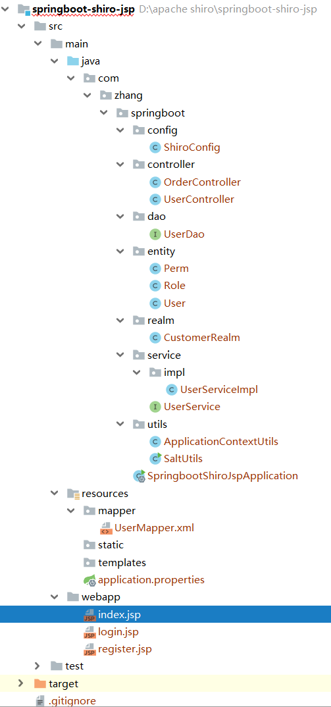

### 4、常见过滤器

>  注意：==shiro提供和多个默认的过滤器，我们可以用这些过滤器来配置控制指定url的权限==

|     配置缩写      |           对应过滤器           |                             功能                             |
| :---------------: | :----------------------------: | :----------------------------------------------------------: |
|     ==anon==      |        AnonymousFilter         |         指定url可以匿名访问（访问时不需要认证授权）          |
|     ==authc==     |    FormAuthenticationFilter    | 指定url需要form表单登录，默认会从请求中获取`username`、`password`,`rememberMe`等参数并尝试登录，如果登录不了就会跳转到loginUrl配置的路径 |
|    authcBasic     | BasicHttpAuthenticationFilter  |                     指定url需要basic登录                     |
|      logout       |          LogoutFilter          |     登出过滤器，配置指定url就可以实现退出功能，非常方便      |
| noSessionCreation |    NoSessionCreationFilter     |                         禁止创建会话                         |
|       perms       | PermissionsAuthorizationFilter |                     需要指定权限才能访问                     |
|       port        |           PortFilter           |                     需要指定端口才能访问                     |
|       rest        |   HttpMethodPermissionFilter   | 将http请求方法转化成相应的动词来构造一个权限字符串，这个感觉意义不大，有兴趣自己看源码的注释 |
|       roles       |    RolesAuthorizationFilter    |                     需要指定角色才能访问                     |
|        ssl        |           SslFilter            |                    需要https请求才能访问                     |
|       user        |           UserFilter           |              需要已登录或“记住我”的用户才能访问              |

## 九、使用CacheManager

### 1、Cache的作用

- Cache 缓存：计算机内存中的一段数据

- 作用：用来减轻DB的访问压力，从而提高系统的查询效率

- 流程：

  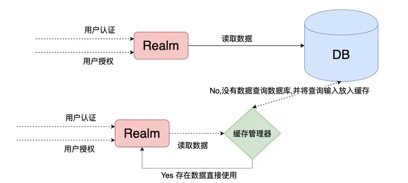

### 2、使用shiro中默认EhCache实现缓存

- 引入依赖

  ```xml
  <!--引入shiro和ehcache-->
  <dependency>
      <groupId>org.apache.shiro</groupId>
      <artifactId>shiro-ehcache</artifactId>
      <version>1.5.3</version>
  </dependency>
  ```

- 开启缓存

  ```java
  // 3、创建自定义Realm
  @Bean
  public Realm getRealm(){
      CustomerRealm customerRealm = new CustomerRealm();
  
      // 修改凭证校验匹配器
      HashedCredentialsMatcher hashedCredentialsMatcher = new HashedCredentialsMatcher();
      // 设置加密算法为md5
      hashedCredentialsMatcher.setHashAlgorithmName("md5");
      // 设置散列次数
      hashedCredentialsMatcher.setHashIterations(1024);
      customerRealm.setCredentialsMatcher(hashedCredentialsMatcher);
  
      // 开启缓存管理
      customerRealm.setCacheManager(new EhCacheManager());
      //开启全局缓存
      customerRealm.setCachingEnabled(true);
      //开启认证缓存
      customerRealm.setAuthenticationCachingEnabled(true);
      customerRealm.setAuthenticationCacheName("authenticationCache");
      //开启授权缓存
      customerRealm.setAuthorizationCachingEnabled(true);
      customerRealm.setAuthorizationCacheName("authorizationCache");
  
      return customerRealm;
  }
  ```

- 启动刷新网页进行测试

  - 注意：如果控制台没有任何sql展示说明缓存已经开启

### 3、shiro中使用Redis作为缓存实现

- 引入Redis依赖

  ```xml
  <!--redis整合springboot-->
  <dependency>
      <groupId>org.springframework.boot</groupId>
      <artifactId>spring-boot-starter-data-redis</artifactId>
  </dependency>
  ```

- 配置Redis连接


